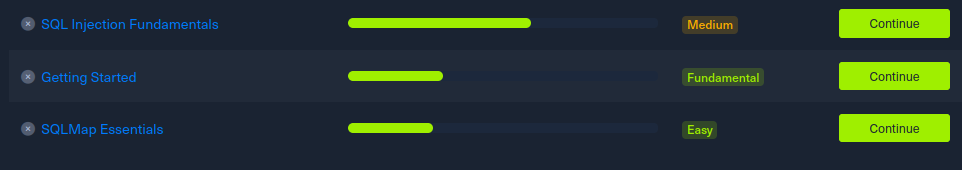
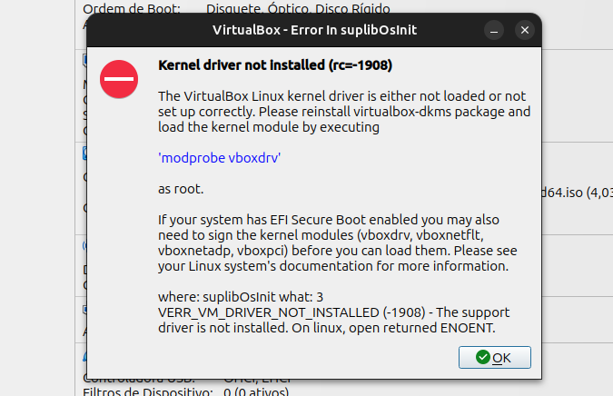

# Relatório da Sprint 1 -  [Red Team]

| Nome | Matrícula| Grupo |
| --  | -- | -- |
| Felipe Direito Corrieri de Macedo | 190086971 | Grupo 2 |

## Hack The Box
Os estudos foram baseados nos módulos do Hack The Box. A seguir tenho o andamento de cada um deles:

## Problemas encontrados

- VirtualBox não inicia a VM. Apenas re-instalar o VirtualBox não solucionou.

## Próximos Passos

- Resolver problemas da VirtualBox
- Finalizar os módulos de estudos
- Realizar os testes de SQLi com SQLMap