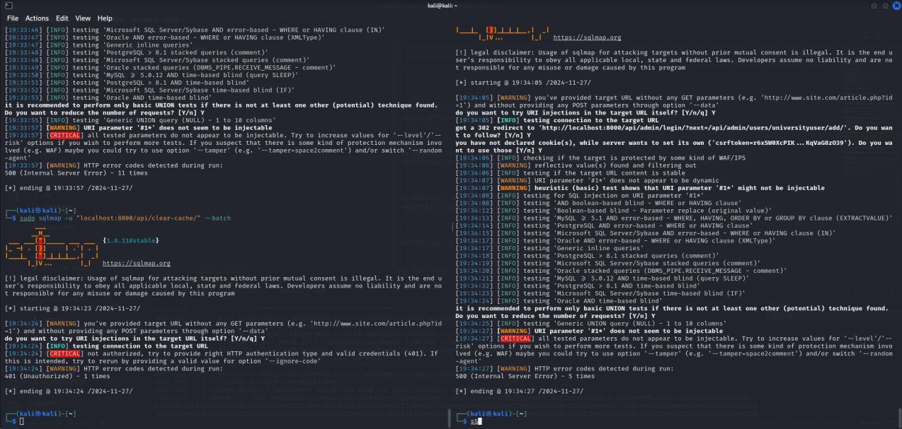

# Relatório Sprint 1 - SQL Injections

## Sobre 
Este relatório é destinado a documentar as descobertas do subgrupo em relação a vunerabilidades ou a inexistência delas em relação a ataques de SQL Injection na aplicação MEC Energia API. Primeiro foi necessário subir o ambiente de desenvolvimento da aplicação, passo esse que todos os membros conseguiram executar com exito. Logo após cada membro possuir uma estância local do projeto, começaram os testes em algumas das rotas da API (As rotas testadas pelo grupo podem ser encontradas [aqui](../../url_mec_energia.txt)).

## O que é SQL Injections

SQL Injection é um tipo de vulnerabilidade de segurança que ocorre em aplicativos que interagem com bancos de dados. Ela acontece quando entradas fornecidas pelo usuário não são devidamente validadas ou sanitizadas, permitindo que códigos maliciosos sejam inseridos em comandos SQL.

Isso pode levar a ações indesejadas, como acesso não autorizado a dados, exclusão ou modificação de informações, e até mesmo controle completo do banco de dados. Para prevenir SQL Injections, é essencial usar técnicas como consultas parametrizadas, validação rigorosa de entradas e o uso de frameworks seguros para manipulação de dados.

No relatório **OWASP Top 10 de 2021**, injeções aparecem em **terceiro lugar** no ranking de vulnerabilidades mais críticas. Aqui estão alguns dados relevantes:

- **94%** das aplicações testadas apresentaram vulnerabilidades a algum tipo de injeção.
- Taxa máxima de incidência: **19%**.
- Taxa média de incidência: **3%**.
- Total de ocorrências relatadas: **274.228**.
- Entre as falhas mais comuns relacionadas estão:
  - **CWE-89**: SQL Injection.
  - **CWE-79**: Cross-site Scripting.
  - **CWE-73**: Controle Externo de Nome ou Caminho de Arquivo.

## Exemplo de SQL Injection

### Cenário 1: Consulta SQL Vulnerável

Imagine uma aplicação que constrói dinamicamente uma consulta SQL sem sanitizar os dados do usuário:

```java
String query = "SELECT * FROM accounts WHERE custID='" + request.getParameter("id") + "'";
```
O atacante pode manipular o parâmetro id na URL para executar comandos maliciosos, como:

```bash
http://example.com/app/accountView?id=' UNION SELECT SLEEP(10);--
```

Isso altera a consulta para:

```SQL
SELECT * FROM accounts WHERE custID='' UNION SELECT SLEEP(10);--
```

Esse comando pode atrasar a resposta do banco de dados ou até mesmo revelar dados sensíveis.

### Cenário 2: Framework Vulnerável (HQL)

Mesmo com frameworks como Hibernate, a falta de atenção à construção de queries pode gerar vulnerabilidades:

```java
Query HQLQuery = session.createQuery("FROM accounts WHERE custID='" + request.getParameter("id") + "'");
```

Um atacante pode injetar comandos para alterar o comportamento esperado, causando resultados similares ao cenário anterior.


## O que é o SQLmap

O SQLmap é uma ferramenta que auxilia na realização de testes de sql injection, a qual realiza automaticamente uma serie de testes em uma url especifica acelerando assim o processo de caça de falhas.

### Como utilizar o SQLmap

Para executar a ferramenta, utilize o seguinte comando no terminal:

```bash
sqlmap -u "URL_ALVO" --batch
```
No comando acima:

- A flag -u especifica a URL alvo.
- A flag --batch aceita automaticamente as perguntas realizadas pela 
ferramenta, permitindo uma execução sem interrupções.

Além disso, é possível utilizar outras flags que refinam e personalizam os testes realizados. Por exemplo:


```bash
sqlmap -u "URL_ALVO" --level 3 --risk 2 --batch
```
Neste exemplo:
- --level define o nível de profundidade dos testes, com valores de 1 a 5.
- --risk especifica o nível de risco dos testes, com valores de 1 a 3. Níveis mais altos implicam testes mais detalhados e complexos.Em nossos testes utilizamos majoritariamente as flags --level e --risk setadas em 1 devido ao tempo de resposta da ferramenta, uma vez que ao selecionar os parametros mais altos os testes demoravam entre 10 a 15 minutos enquanto com os parametros mais baixos os testes demoravam cerca de 1 a 2 minutos possibilitando a realização dos testes em todas as URL's necessárias.

### Experiência com os testes

Em nossos testes, utilizamos principalmente os valores --level 1 e --risk 1, priorizando a rapidez nos resultados.

- Com parâmetros baixos: os testes foram concluídos em 1 a 2 minutos, permitindo analisar todas as URLs necessárias com eficiência.
- Com parâmetros altos: os testes demoraram entre 10 a 15 minutos, tornando o processo menos prático em alguns casos.
Essa abordagem balanceou o tempo de resposta com a eficácia dos testes.

## Dificuldades encontradas

### Mateus Fidelis

### Pablo Guilherme

- A maior dificuldade foi em subir o ambiente devido a um conflito de versões do docker que ocorreu ao instalar a VM do Kali Linux, para corrigir este erro eu alterei os arquivos de Makefile com o objetivo de substituir os comandos docker compose por docker-compose

### Pedro Lucas

### Rafael Bosi

- Todos os membros foram orientados a subir uma máquina virtual que possuisse o sistema operacional Kali linux, eu não consegui subir essa máquina. O Kali linux tem várias ferramentas e softwares que auxiliam na busca e descoberta de vunerabilidades em aplicação, como o próprio SQLmap. Por não ter conseguido utilizar o Kali, tive que instalar e executar essa ferramenta no Ubuntu, também tive dificuldade nisso. 


## Testes executados na Api do Mec Energia

Para essa primeira Sprint foram testadas pelo grupo mais de [40 rotas](../../url_mec_energia.txt) da API do MEC Energia. Não foi encontrada nenhuma vunerabilidade em relação a SQL Injections nas rotas exploradas. Isso nos mostra que os campos de input para usuários, pelo menos nessas rotas, tem validações e são tratados no backend da aplicação.

Abaixo é possível ver um screenshot de alguns dos testes realizados em cima das rotas da API. Também é possível observar na mesma imagem que nenhum dos testes rodados encontrou nenhuma vunerabilidade. No screenshot foram testadas as rotas "/api/clear-cache/", "/api/admin/login" e "/api/admin/login/?next/".


Imagem 1 - Explorando algumas rotas com SQLmap

## Referências

- [OWASP Proactive Controls: Secure Database Access](https://owasp.org/www-project-proactive-controls/)
- [OWASP ASVS: V5 Input Validation and Encoding](https://owasp.org/www-project-application-security-verification-standard/)
- [OWASP Testing Guide: SQL Injection, Command Injection, and ORM Injection](https://owasp.org/www-project-web-security-testing-guide/)
- [OWASP Cheat Sheet: Injection Prevention](https://owasp.org/www-project-cheat-sheets/)
- [OWASP Cheat Sheet: SQL Injection Prevention](https://owasp.org/www-project-cheat-sheets/)
- [OWASP Cheat Sheet: Injection Prevention in Java](https://owasp.org/www-project-cheat-sheets/)
- [OWASP Cheat Sheet: Query Parameterization](https://owasp.org/www-project-cheat-sheets/)
- [OWASP Automated Threats to Web Applications – OAT-014](https://owasp.org/www-project-automated-threats-to-web-applications/)
- [PortSwigger: Server-side template injection](https://portswigger.net/web-security/server-side-template-injection)


