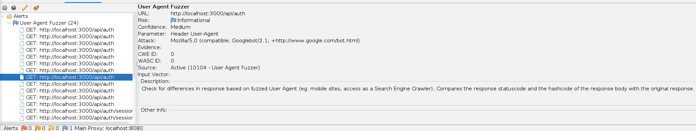
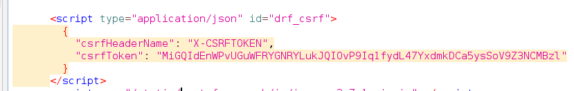
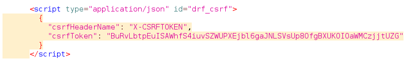
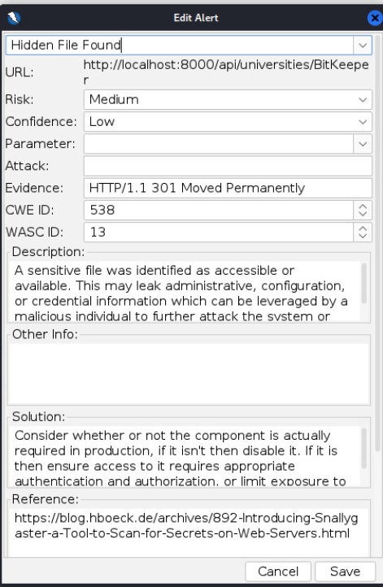
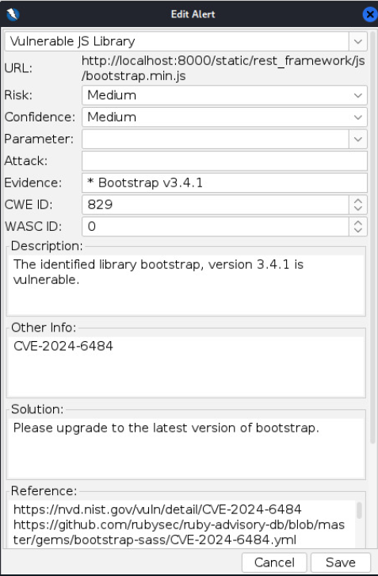

# Relatório da Sprint 2 - Information Gathering

## Arthur de Melo Viana - 211029147

No início, utilizei o scan em modo de ataque da ferramenta OWASP ZAP para identificar possíveis conteúdos para estudar, dado que o monitor Rodolfo permitiu o estudo de módulos livres. Ao fazer o scan em api/auth e em api/universities, as flags levantadas foram de User Agent Fuzzing.
Sendo assim, fui estudar alguns módulos no Hack the Box para ver quais tipos de vulnerabiliades eu poderia explorar com essa informação, o que me levou ao tópico de Information Gathering. O resultado do scan está no bloco a seguir. Além disso, arquivo `csv` pode-se analisar as requests feitas durante a realização de tal.

```
Strength	Progress	Elapsed	Reqs	Alerts	Status	
User Agent Fuzzer	Medium	100	00:09.264	72	24	Completed				
Totals			09:55.240	1374	24
```

Todas as outras opções não emitiram alertas, sendo elas:
```
Path Traversal, Remote File Inclusion, Heartbleed OpenSSL Vulnerability, Source Code Disclosure - /WEB-INF Folder, Source Code Disclosure - CVE-2012-1823
Remote Code Execution - CVE-2012-1823, External Redirect, Server Side Include, Cross Site Scripting (Reflected), Cross Site Scripting (Persistent) - Prime
Cross Site Scripting (Persistent) - Spider, Cross Site Scripting (Persistent)
SQL Injection, SQL Injection - MySQL, SQL Injection - Hypersonic SQL, SQL Injection - Oracle, SQL Injection - PostgreSQL, SQL Injection - SQLite
Cross Site Scripting (DOM Based), SQL Injection - MsSQL, Log4Shell, Spring4Shell, Server Side Code Injection
Remote OS Command Injection, XPath Injection, XML External Entity Attack, Generic Padding Oracle
Cloud Metadata Potentially Exposed, Server Side Template Injection, Server Side Template Injection (Blind)
Directory Browsing, Buffer Overflow, Format String Error, CRLF Injection, Parameter Tampering
ELMAH Information Leak, Trace.axd Information Leak, .htaccess Information Leak, .env Information Leak
Spring Actuator Information Leak, Hidden File Finder, XSLT Injection, GET for POST, User Agent Fuzzer
Script Active Scan Rules, SOAP Action Spoofing, SOAP XML Injection
```

Os alertas identificados no scan são desse padrão. O que significa que ao mudar o user agent, por meio de um scraping ou crawling, pode-se obter informações diferentes acerca de informações encriptadas.
O que pode auxiliar na criação de um dicionário ou no descobrimento do método utilizado para gerar aquela hash.



Tanto em api/auth quanto em api/universities, as alterações realizadas ao modificar o user agent foram do csrfToken, como pode-se analisar nas imagens a seguir:






Ao analisar as hashes obtidas a partir do csrfToken, obtive os seguintes resultados com o hash-identifier:

```
HASH: zYqIyZtXO4TtjvEJUTtigM2rAnFAL71o

Possible Hashs:
[+] MD5
[+] Domain Cached Credentials - MD4(MD4(($pass)).(strtolower($username)))

Least Possible Hashs:
[+] RAdmin v2.x
[+] NTLM
[+] MD4
[+] MD2
[+] MD5(HMAC)
[+] MD4(HMAC)
[+] MD2(HMAC)
[+] MD5(HMAC(Wordpress))
[+] Haval-128
[+] Haval-128(HMAC)
[+] RipeMD-128
[+] RipeMD-128(HMAC)
[+] SNEFRU-128
[+] SNEFRU-128(HMAC)
[+] Tiger-128
[+] Tiger-128(HMAC)
[+] md5($pass.$salt)
[+] md5($salt.$pass)
[+] md5($salt.$pass.$salt)
[+] md5($salt.$pass.$username)
[+] md5($salt.md5($pass))
[+] md5($salt.md5($pass))
[+] md5($salt.md5($pass.$salt))
[+] md5($salt.md5($pass.$salt))
[+] md5($salt.md5($salt.$pass))
[+] md5($salt.md5(md5($pass).$salt))
[+] md5($username.0.$pass)
[+] md5($username.LF.$pass)
[+] md5($username.md5($pass).$salt)
[+] md5(md5($pass))
[+] md5(md5($pass).$salt)
[+] md5(md5($pass).md5($salt))
[+] md5(md5($salt).$pass)
[+] md5(md5($salt).md5($pass))
[+] md5(md5($username.$pass).$salt)
[+] md5(md5(md5($pass)))
[+] md5(md5(md5(md5($pass))))
[+] md5(md5(md5(md5(md5($pass)))))
[+] md5(sha1($pass))
[+] md5(sha1(md5($pass)))
[+] md5(sha1(md5(sha1($pass))))
[+] md5(strtoupper(md5($pass)))
--------------------------------------------------
HASH: BuRvLbtpEuISAWhfS4iuvSZWUPXEjbL6gaJNLSvUp80fgBXUKOI0aWMCzjtUZG
Not Found.
--------------------------------------------------
HASH: MiGQIdEnWPvUGwFRYGNRYLukJQI0vP9Iq1fydL47YxdmkDCa5ysSoV9Z3NCMBz1
Not Found.
```

No caso, somente a primeira hash, que é de uma sessão autenticada, foi possível de obter algum tipo de análise por meio da ferramenta. As outras não.
Além disso, a ferramenta hashid também identificou outro possível padrão para a primeira hash:

```
Analyzing 'zYqIyZtXO4TtjvEJUTtigM2rAnFAL71o'
[+] DNSSEC(NSEC3)
```

Por fim, o scan realizado também levantou mais dois alertas: um de "Hidden File Found" e outro de "Vulnerable JS Library".

Quanto ao primeiro, provavelmente se trata de um falso-positivo, dado que ao pesquisar o caminho onde teria encontrado tal arquivo, deu Erro 404.



Quanto à vulnerabilidade encontrada, trata-se de uma versão do bootstrap que está vulnerável a ataques de Cross-Site Scripting (XSS), a correção sugerida está na imagem a seguir:



### Dificuldades

Tentei utilizar de um método para crawling por meio de um script em python do HTB, mas ainda não encontrei um método para realizar o crawling com o header autenticado como usuário padrão (usuario@unb.br).
Ainda não encontrei formas de utilizar das informações coletadas para chegar em algo mais relevante.

### Próximos passos

Explorar vulnerabilidades por meio de crawling e fuzzing. Por exemplo, realizar um fuzzing pelo OWASP ZAP em algum request da seguinte forma (talvez modificar o user agent de outras formas, diferente do scan geral):

```
EXEMPLO DE FUZZING NO PATH
File fuzzers -> directory-list-1.0.txt
Processors -> URL Encode -> UTF-8
Posso utilizar:
    Base64 Decode/Encode
    MD5 Hash
    Postfix String
    Prefix String
    SHA-1/256/512 Hash
    URL Decode/Encode
    Script
```
