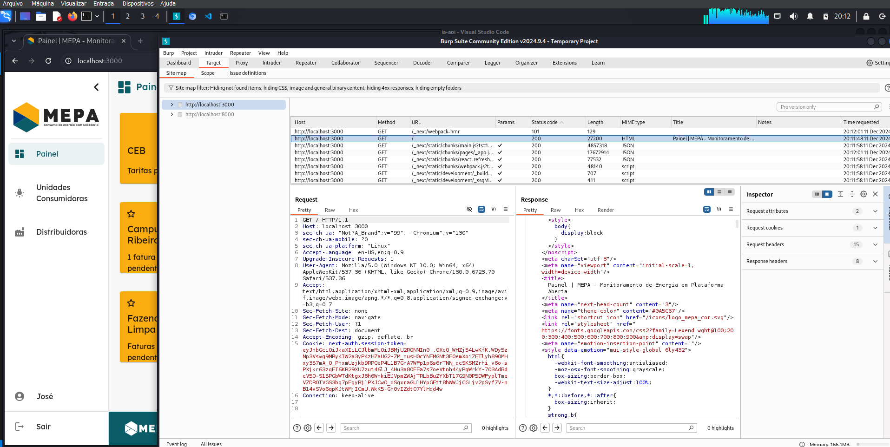
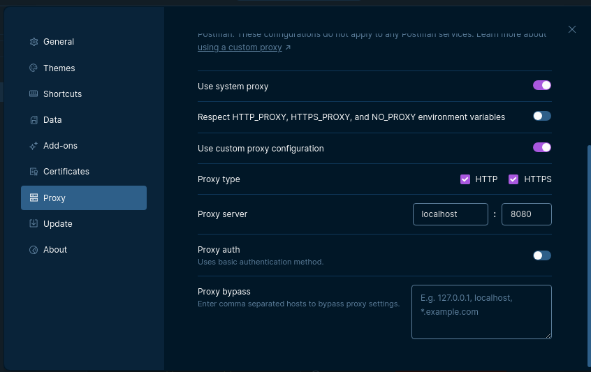
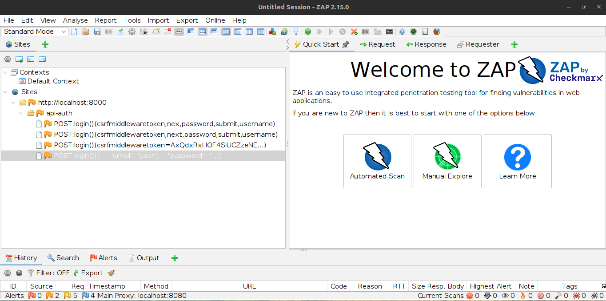
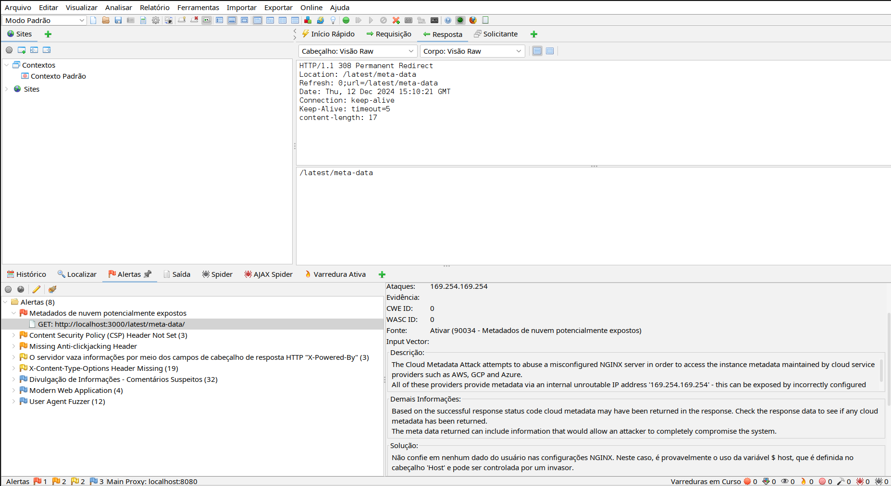

# Relatório Sprint 2 - Broken Authentication

## Membros

| Nome | Matrícula |
| :--: | :-------: |
| [Mateus Fidelis](https://github.com/MatsFidelis) | 200073184 |
| [Pablo Guilherme](https://github.com/PabloGJBS) | 200025791 |
| [Pedro Lucas](https://github.com/AlefMemTav)     | 190115548 |
| [Rafael Bosi](https://github.com/strangeunit28) | 211029559 |

## Sobre 
Este relatório tem como objetivo documentar as descobertas e o progresso alcançado durante a Sprint 2, com foco na vulnerabilidade conhecida como **Broken Authentication**. A análise abrange a natureza dessa falha,  exemplos práticos de como ela ocorre , métodos de identificação em sistemas reais, além de registrar os desafios enfrentados pela equipe e os aprendizados adquiridos ao longo do processo.

## O que é Broken Authentication

Broken Authentication é uma categoria de vulnerabilidade que surge quando os mecanismos de autenticação de um sistema não são projetados ou implementados adequadamente, permitindo que atacantes assumam a identidade de usuários legítimos. Algumas das formas mais comuns de exploração incluem:

- **Políticas de senhas fracas:** Uso de senhas vulneráveis ou previsíveis, que facilitam ataques de força bruta ou baseados em dicionários.
- **Fixação de sessão (Session Fixation):** Ataques que manipulam um usuário para utilizar uma sessão controlada pelo invasor, permitindo que este a assuma posteriormente.
- **CSRF (Cross-Site Request Forgery):** Ataques que induzem usuários autenticados a realizar ações indesejadas em uma aplicação web sem o seu consentimento.
- **Ataques de força bruta (Brute Force):** Tentativas sistemáticas de adivinhar credenciais por meio de combinações exaustivas de nome de usuário e senha.

## Principais Indicadores de Broken Authentication

- Logins fora do padrão geográfico: Detecção de tentativas de login vindas de locais geograficamente distantes em curto período.
- Sessões simultâneas em dispositivos suspeitos: Atividade simultânea de uma mesma conta em dispositivos ou IPs distintos.
- Falhas consecutivas de login por diferentes contas no mesmo IP: Indicativo de ataque de força bruta ou credential stuffing.

## Ferramentas para Identificação e Mitigação
- OWASP ZAP e Burp Suite: Ferramentas que auxiliam na identificação de vulnerabilidades relacionadas à autenticação.
- Autenticação adaptativa: Sistema que aumenta os requisitos de autenticação com base em riscos detectados, como logins de dispositivos desconhecidos.
- Auditorias regulares de segurança: Revisão contínua de logs e práticas de autenticação.

## Exemplo de Broken Authentication

### 1. Força bruta em endpoints de login

**Cenário:**
Um sistema não limita o número de tentativas de login, permitindo múltiplas requisições sem bloqueio temporário após falhas consecutivas.

**Exploração:**
1. O atacante coleta uma lista de credenciais comuns (por exemplo, `rockyou.txt`).
2. Utiliza ferramentas como `Hydra`, `Burp Suite` ou `FFuF` para tentar combinações até encontrar credenciais válidas.
3. Após a autenticação, o atacante obtém acesso a dados ou funcionalidades do usuário.

**Prevenção:**
- Implementar bloqueios temporários após múltiplas falhas de login consecutivas.
- Adotar autenticação multifator (MFA) para fortalecer a segurança.
- Monitorar e alertar sobre padrões de login suspeitos, como um alto volume de tentativas em curto período.

### 2. Reutilização de Credenciais (Credential Stuffing)

**Como funciona:**  
O atacante utiliza listas de credenciais vazadas de outras plataformas para testar combinações de nome de usuário e senha em um sistema-alvo. Essa técnica explora o fato de muitos usuários reutilizarem as mesmas credenciais em diferentes serviços.

**Exemplo prático:**  
Uma empresa não implementa autenticação multifator (MFA). Um atacante obtém credenciais de um vazamento público e tenta usá-las para acessar o sistema. Como vários usuários reutilizam as mesmas senhas em vários serviços, o atacante consegue invadir algumas contas sem esforço significativo.

**Mitigação:**  
- Incentivar o uso de senhas únicas para cada sistema.  
- Verificar credenciais contra bancos de dados de vazamentos conhecidos, como o serviço `Have I Been Pwned`.  
- Implementar autenticação multifator (MFA) para reduzir o impacto de credenciais reutilizadas.

### 3. Sessões Expostas (Session Hijacking)

**Como funciona:**  
Sessões expostas ocorrem quando um atacante rouba uma sessão válida de um usuário para acessar o sistema, explorando vulnerabilidades nos cookies de sessão ou na comunicação entre o cliente e o servidor. Esse roubo pode ser realizado por meio de ataques como **Man-in-the-Middle (MITM)**, em que o tráfego é interceptado, ou por meio de scripts maliciosos que capturam cookies desprotegidos.

**Exemplo prático:**  
Um site não marca seus cookies de sessão com as flags `HttpOnly` ou `Secure`. Um atacante intercepta o tráfego HTTP de uma vítima, por exemplo, usando um ataque MITM em uma rede Wi-Fi pública, e consegue roubar os cookies de sessão. Com esses cookies, o atacante se passa pelo usuário, obtendo acesso à conta sem precisar das credenciais.

**Mitigação:**  
- Utilizar HTTPS: Assegurar que todo o tráfego entre o cliente e o servidor seja criptografado, impedindo que dados sensíveis sejam interceptados.
- 
- Configurar cookies com as flags de segurança:
  - `HttpOnly` (para impedir acesso por scripts)
  - `Secure` (para transmitir apenas via HTTPS).
  
- Implementar expiração de sessão e invalidação de tokens após o logout.  
- Utilizar tokens de sessão que mudam periodicamente (revalidação contínua).
- Proteção contra XSS: Prevenir a execução de scripts maliciosos que possam roubar cookies utilizando boas práticas como validação de entradas e o uso de Content Security Policy (CSP).

## Teste de Broken Authentication na API do MEC Energia

### Teste com o **_FFUF_**

Utilizando a ferramenta FFUF, conseguimos realizar testes de força-bruta para tentar identificar possíveis nomes de usuários que estão cadastrados na aplicação. Para isso conseguimos utilizar uma base de dados OSINT que nos auxilia a testar diferentes possibilidades, nos entregando valores que correspondem a nossa pesquisa. Para o caso da API do MEC - energia, não foram encontrados email's ou nomes de usuários que poderiam estar cadastrados, até porque a forma como está implementada os requisitos de segurança, não nos permite realizar essas deduções.

  

**Imagem 1** - Explorando a aplicação web com _FFUF_

### Teste com o **_burpSuite_**

Após concluir os testes iniciais focados nas rotas da API, que não evidenciaram vulnerabilidades significativas, decidimos ampliar o escopo da análise para a aplicação web como um todo. Com a ferramenta Burp Suite, interceptamos as requisições HTTP da página de login para manipular o token de autenticação, com o objetivo de explorar possíveis falhas que permitissem elevar os privilégios de um usuário comum para o perfil de administrador.

Apesar de diversas tentativas de adulteração do token, todas as investidas falharam. Esse resultado sugere que a aplicação utiliza mecanismos robustos de autenticação e autorização, como:

Validação do lado do servidor: Garantindo que os tokens sejam verificados adequadamente em cada requisição.
Assinatura de tokens: Tornando os tokens difíceis de adulterar sem a chave correta.
Controle de acesso baseado em papéis (RBAC): Limitando as permissões de cada usuário de acordo com seu nível de acesso.
Essa resistência demonstra uma atenção significativa à segurança na implementação da autenticação e autorização da aplicação.

  

**Imagem 2** - Explorando a aplicação web com _BurpSuite_, **_Fonte_** [Pablo Silva](https://github.com/PabloGJBS/)

### Test com OWASP ZAP

O OWASP Zap permite diversas técnicas para testar um site. Por padrão, ele escuta na porta 8080, então é necessário configurar o cliente da requisição (como o Firefox ou o Postman por exemplo) para usar o Proxy na porta 8080. 

Exemplo com Postman:

Na imagem abaixo, após configurar o Proxy do Postman, toda requisição feita será enviada automáticamente para o OWASP ZAP.

**Imagem 3** - Configurando o Proxy do Postman escutar na porta 8080, **_Fonte_** [Pedro Lucas Garcia](https://github.com/AlefMemTav/)

Agora é necessário configurar o corpo da requisição. No caso do Postman, este foi o corpo de a API exigia receber para a rota de login:

**Imagem 4** - Configurando o Postman para envio da requisição, **_Fonte_** [Pedro Lucas Garcia](https://github.com/AlefMemTav/)

Por fim, no OWASP ZAP é possível ver as requisições sendo capturadas. Apesar da API do MEC-ENERGIA escutar na porta 8000, o OWASP consegue capturar toda a requisição feita na porta 8000 pelo cliente (no caso o Postman) e receber:

**Imagem 5** - Configurando o Postman para envio da requisição, **_Fonte_** [Pedro Lucas Garcia](https://github.com/AlefMemTav/)

### Alets gerados no MEC Energia

Durante os testes realizados na aplicação MEC Energia com OWASP ZAP, foram gerados alguns alertas importantes, como demonstrado na imagem abaixo:

**Imagem 6** - Alerts gerados com o _ZAP_, **_Fonte_** [Rafael Bosi](https://github.com/strangeunit28)

Dentre os alerts, os que são mais preocupantes são:

1. Exposição de Metadados de Nuvem - High risk

Foi detectada uma possível vulnerabilidade relacionada à exposição de metadados da nuvem, onde um servidor NGINX mal configurado poderia permitir acesso ao IP interno 169.254.169.254. Caso isso ocorra, dados sensíveis da nuvem podem ser acessados por um atacante, incluindo credenciais temporárias.

2. Vazamento de Informações no Cabeçalho "X-Powered-By" - Medium risk

O cabeçalho HTTP "X-Powered-By" revelou informações sobre a tecnologia usada no servidor. Embora as informações expostas não fossem críticas, em um cenário mais grave, isso poderia facilitar ataques baseados em versões específicas de frameworks ou servidores.

**Imagem 7** - Alert sobre X-Powered-By gerados com o _ZAP_, **_Fonte_** [Rafael Bosi](https://github.com/strangeunit28)

3. Missing Anti-clickjacking Header - Medium risk

A aplicação não incluiu cabeçalhos de proteção contra Clickjacking. A falta de X-Frame-Options ou a diretiva Content-Security-Policy (frame-ancestors) pode permitir que a aplicação seja carregada em um iframe, facilitando ataques onde o usuário é enganado a clicar em elementos invisíveis ou falsificados.

## Dificuldades encontradas

### Mateus Fidelis

Nesta sprint, as dificuldades em encontrar vulnerabilidades na aplicação se estenderam mais por minha parte ao estudo e entendimento do contexto, pois cada ação que vamos tomar exige um nível mais alto de conhecimento prático e teórico do que estamo fazendo, cada parametro precisa ser muito bem pesquisado para que gere um resultado mais compreensível. No fim os testes automaticos e manuais não demonstraram nenhuma vulnerabilidade ou falta de prática de segurança no desenvolvimento.

### Pablo Guilherme

Ao comparar o módulo de SQL Injection com o módulo atual, percebi uma diferença significativa no nível de complexidade. Enquanto o primeiro módulo se concentrava em falhas mais diretas e específicas de entrada de dados, o atual demandou uma compreensão mais profunda das possíveis vulnerabilidades da aplicação e uma abordagem mais analítica para identificar potenciais pontos fracos.  

Além disso, a ausência de uma ferramenta tão específica quanto o SQLMap, amplamente utilizado no módulo anterior, tornou o processo mais desafiador. No módulo atual, as vulnerabilidades eram mais variadas, exigindo um entendimento mais abrangente e uma análise detalhada para explorar eventuais falhas.  

Apesar das dificuldades, o aprendizado adquirido e a aplicação prática do conhecimento foram extremamente recompensadores, proporcionando um senso de realização e ampliando minha capacidade de lidar com cenários mais complexos de segurança.

### Pedro Lucas

### Rafael Bosi

Nesta sprint, aprendi sobre Broken Authentication e os modelos de teste para identificar vulnerabilidades, como brute force. Tive dificuldades para configurar o navegador interno do Burp Suite, mas consegui resolver após ajustes. Os testes não apontaram falhas críticas, apenas a recomendação de limitar tentativas de login para prevenir ataques de força bruta, reforçando a segurança da aplicação.

## Referências

- OWASP. [Top 10 Vulnerabilities](https://owasp.org/www-project-top-ten/).
- PortSwigger. [Authentication vulnerabilities](https://portswigger.net/web-security/authentication).
- The MITRE Corporation. [CWE-287: Improper Authentication](https://cwe.mitre.org/data/definitions/287.html).
- Tools: Burp Suite, Hydra, OWASP ZAP.

