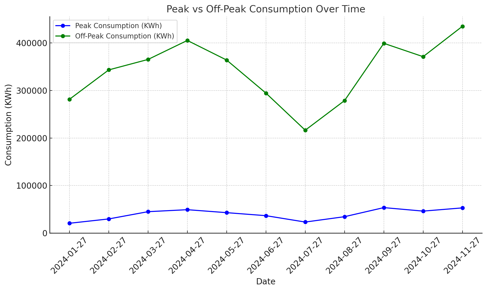

# Relatório da Sprint 3 - Insecure Direct Object References (IDOR)

## Arthur de Melo Viana - 211029147

A fim de identificar vulnerabilidades de IDOR, realizei uma sessão com um usuário padrão da UnB no `web` e outra sessão com um usuário padrão da UFMG na `api`.
Desta forma, realizei os testes manuais na API autenticada em alguns requests de tipo 200 feitos no `web` para ver se o usuário da UFMG autenticado na `api` pudesse acessar dados dos quais ele não deveria ter acesso. Os requests verificados foram do formato: `http://localhost:8000/api/.../?x=id`. Onde a verificação manual foi feita ao alterar o valor do id, o qual segue um padrão.

Não foi possível encontrar vulnerabilidades nos requests desses tipos (os dados nos ids são apenas exemplos), dado que o usuário não possuía permissão para acessar as informações:

- `http://localhost:8000/api/distributors/7/get-tariffs/?subgroup=A4`
- `http://localhost:8000/api/distributors/?university_id=2`
- `http://localhost:8000/api/contracts/?consumer_unit_id=13`
- `http://localhost:8000/api/contracts/get-current-contract-of-consumer-unit/?consumer_unit_id=13`
- `http://localhost:8000/api/distributors/?university_id=2`

Contudo, foi possível obter informações em cima das seguintes requisições:

### api/energy-bills/plot-graph/?consumer_unit_id=id e api/recommendation/id

O usuário autenticado da UFMG foi capaz de obter todas as informações das contas de energia de todas as unidades consumidoras. Contudo, sem autenticação, não foi possível realizar o mesmo. O primeiro a seguir mostra as informações obtidas para a unidade consumidora `1` por meio do `api/energy-bills/plot-graph/?consumer_unit_id=id`, já o segundo, para a mesma UC, a informação por meio da `api/recommendation/id`:




Contudo, por meio da `api/recommendation/id`, foi possível pegar informações adicionais, como:

- generatedOn: Data e hora em que os dados foram gerados.
- dates: Lista de datas associadas ao consumo de energia.
- shouldRenewContract: Indica se o contrato deve ser renovado.
- energyBillsCount: Número de faturas de energia.
- nominalSavingsPercentage: Percentual de economia nominal (1%).
- currentContract: Detalhes do contrato atual (informações como universidade, distribuidora, unidade consumidora, etc.).
- consumptionHistoryTable: Histórico de consumo, com dados sobre consumo de energia em horários de pico e fora de pico.
- consumptionHistoryPlot: Dados do histórico de consumo representados graficamente.
- detailedContractsCostsComparisonPlot: Comparação detalhada dos custos entre os contratos.
- currentContractCostsPlot: Gráfico dos custos atuais do contrato.
- tariffDates: Período de validade das tarifas de energia.
- tariffsTable: Tabela com informações sobre tarifas (custo por kWh ou kW em diferentes horários).
- recommendedContract: Informações sobre um contrato recomendado, incluindo dados de consumo e tarifas.
- costsComparisonPlot: Comparação dos custos entre o contrato atual e o recomendado ao longo do tempo.
- contractsComparisonTable: Tabela comparativa dos custos por data, com as diferenças entre os custos atuais e recomendados.
- contractsComparisonTotals: Totais das comparações de custos entre o contrato atual e o recomendado.
- currentTotalCost: Custo total atual (somatório dos custos das faturas de energia).

Para ambas as requisições, as informações foram coletadas por meio de dois scripts python em [energy-bills.py](docs/energy-bills.py) e [recommendation.py](docs/consumo-energia.py). E os resultados foram guardados em [energy-bills.txt](docs/energy-bills.txt) e [consumo-energia.txt](docs/consumo-energia.txt).

Exemplo de como as informações foram guardadas para o id=1:

```
{'generatedOn': '2025-01-15T12:57:14.130080', 'errors': [], 'warnings': [[4, 'Lance mais 1 fatura dos últimos 12 meses para aumentar a precisão da análise'], [5, 'Atualize as tarifas vencidas para aumentar a precisão da análise']], 'dates': ['2024-01-27', '2024-02-27', '2024-03-27', '2024-04-27', '2024-05-27', '2024-06-27', '2024-07-27', '2024-08-27', '2024-09-27', '2024-10-27', '2024-11-27', '2024-12-01'], 'shouldRenewContract': False, 'energyBillsCount': 11, 'nominalSavingsPercentage': 1.0, 'currentContract': {'university': 'Universidade Federal de Minas Gerais', 'distributor': 'CEMIG', 'consumerUnit': 'Campus Centro', 'consumerUnitCode': '1090000019', 'tariffFlag': 'B', 'subgroup': 'A3', 'peakDemandInKw': 1000.0, 'offPeakDemandInKw': 1680.0}, 'consumptionHistoryTable': [{'date': '2024-01-27', 'peakConsumptionInKwh': 20707.0, 'offPeakConsumptionInKwh': 281450.0, 'peakMeasuredDemandInKw': 538.0, 'offPeakMeasuredDemandInKw': 1306.62}, {'date': '2024-02-27', 'peakConsumptionInKwh': 29836.0, 'offPeakConsumptionInKwh': 343275.0, 'peakMeasuredDemandInKw': 665.28, 'offPeakMeasuredDemandInKw': 1319.22}, {'date': '2024-03-27', 'peakConsumptionInKwh': 45102.0, 'offPeakConsumptionInKwh': 365257.0, 'peakMeasuredDemandInKw': 1094.94, 'offPeakMeasuredDemandInKw': 1863.54}, {'date': '2024-04-27', 'peakConsumptionInKwh': 49273.0, 'offPeakConsumptionInKwh': 405235.0, 'peakMeasuredDemandInKw': 1115.1, 'offPeakMeasuredDemandInKw': 1799.28}, {'date': '2024-05-27', 'peakConsumptionInKwh': 43034.0, 'offPeakConsumptionInKwh': 363988.0, 'peakMeasuredDemandInKw': 1049.58, 'offPeakMeasuredDemandInKw': 1501.92}, {'date': '2024-06-27', 'peakConsumptionInKwh': 36692.0, 'offPeakConsumptionInKwh': 294456.0, 'peakMeasuredDemandInKw': 946.26, 'offPeakMeasuredDemandInKw': 1324.26}, {'date': '2024-07-27', 'peakConsumptionInKwh': 23281.0, 'offPeakConsumptionInKwh': 216430.0, 'peakMeasuredDemandInKw': 635.04, 'offPeakMeasuredDemandInKw': 1014.3}, {'date': '2024-08-27', 'peakConsumptionInKwh': 34557.0, 'offPeakConsumptionInKwh': 278715.0, 'peakMeasuredDemandInKw': 811.44, 'offPeakMeasuredDemandInKw': 1326.78}, {'date': '2024-09-27', 'peakConsumptionInKwh': 53644.0, 'offPeakConsumptionInKwh': 399173.0, 'peakMeasuredDemandInKw': 1278.9, 'offPeakMeasuredDemandInKw': 1929.06}, {'date': '2024-10-27', 'peakConsumptionInKwh': 46293.0, 'offPeakConsumptionInKwh': 371087.0, 'peakMeasuredDemandInKw': 1144.4, 'offPeakMeasuredDemandInKw': 1842.12}, {'date': '2024-11-27', 'peakConsumptionInKwh': 53072.0, 'offPeakConsumptionInKwh': 434993.0, 'peakMeasuredDemandInKw': 1362.06, 'offPeakMeasuredDemandInKw': 2055.06}, {'date': '2024-12-01', 'peakConsumptionInKwh': None, 'offPeakConsumptionInKwh': None, 'peakMeasuredDemandInKw': None, 'offPeakMeasuredDemandInKw': None}], 'consumptionHistoryPlot': {'date': ['2024-01-27', '2024-02-27', '2024-03-27', '2024-04-27', '2024-05-27', '2024-06-27', '2024-07-27', '2024-08-27', '2024-09-27', '2024-10-27', '2024-11-27', '2024-12-01'], 'peakConsumptionInKwh': [20707.0, 29836.0, 45102.0, 49273.0, 43034.0, 36692.0, 23281.0, 34557.0, 53644.0, 46293.0, 53072.0, None], 'offPeakConsumptionInKwh': [281450.0, 343275.0, 365256.0, 405235.0, 363988.0, 294456.0, 216430.0, 278715.0, 399173.0, 371087.0, 434993.0, None], 'peakMeasuredDemandInKw': [538.0, 665.28, 1094.94, 1115.1, 1049.58, 946.26, 635.04, 811.44, 1278.9, 1144.4, 1362.06, None], 'offPeakMeasuredDemandInKw': [1306.62, 1319.22, 1863.54, 1799.28, 1501.92, 1324.26, 1014.3, 1326.78, 1929.06, 1842.12, 2055.06, None], 'contractPeakDemandInKw': [1000.0, 1000.0, 1000.0, 1000.0, 1000.0, 1000.0, 1000.0, 1000.0, 1000.0, 1000.0, 1000.0, None], 'contractOffPeakDemandInKw': [1680.0, 1680.0, 1680.0, 1680.0, 1680.0, 1680.0, 1680.0, 1680.0, 1680.0, 1680.0, 1680.0, None]}, 'detailedContractsCostsComparisonPlot': {'totalCostInReaisInCurrent': [259387.29061999999, 287544.42001, 346720.60312000004, 363331.88613, 315634.37424, 272767.11112, 236229.62946, 265698.50137, 419515.92839, 360773.91773, 466916.59906999994, None], 'demandCostInReaisInRecommended': [165569.14, 165569.14, 165569.14, 165569.14, 165569.14, 165569.14, 165569.14, 165569.14, 194472.31300000002, 165569.14, 228104.8576, None], 'consumptionCostInReaisInRecommended': [117126.89061999999, 145284.02000999998, 161667.57672, 178956.95393, 160092.97963999998, 130506.71111999999, 93969.22946, 123438.10137, 178987.99998999998, 164498.15892999998, 192194.26146999997, None]}, 'currentContractCostsPlot': {'consumptionCostInReais': [117126.89061999999, 145284.02000999998, 161667.57672, 178956.95393, 160092.97963999998, 130506.71111999999, 93969.22946, 123438.10137, 178987.99998999998, 164498.15892999998, 192194.26146999997, None], 'demandCostInReais': [142260.4, 142260.4, 185053.02640000003, 184374.93219999998, 155541.3946, 142260.4, 142260.4, 142260.4, 240527.92840000003, 196275.7588, 274722.33759999997, None]}, 'tariffDates': {'startDate': '2023-10-02', 'endDate': '2024-10-05'}, 'tariffsTable': [{'label': 'off_peak_tusd_in_reais_per_mwh', 'billingTime': 'Fora ponta', 'blue': 117.13, 'green': 117.13}, {'label': 'off_peak_te_in_reais_per_mwh', 'billingTime': 'Fora ponta', 'blue': 260.02, 'green': 260.02}, {'label': 'na_tusd_in_reais_per_kw', 'billingTime': 'NA', 'blue': None, 'green': 31.53}, {'label': 'peak_tusd_in_reais_per_mwh', 'billingTime': 'Ponta', 'blue': 117.13, 'green': 2280.15}, {'label': 'peak_tusd_in_reais_per_kw', 'billingTime': 'Ponta', 'blue': 89.29, 'green': None}, {'label': 'off_peak_tusd_in_reais_per_kw', 'billingTime': 'Fora ponta', 'blue': 31.53, 'green': None}, {'label': 'peak_te_in_reais_per_mwh', 'billingTime': 'Ponta', 'blue': 413.03, 'green': 413.03}], 'recommendedContract': {'university': 'Universidade Federal de Minas Gerais', 'distributor': 'CEMIG', 'consumerUnit': 'Campus Centro', 'consumerUnitCode': '1090000019', 'subgroup': 'A3', 'tariffFlag': 'B', 'offPeakDemandInKw': 1935.0, 'peakDemandInKw': 1171.0}, 'costsComparisonPlot': {'date': ['2024-01-27', '2024-02-27', '2024-03-27', '2024-04-27', '2024-05-27', '2024-06-27', '2024-07-27', '2024-08-27', '2024-09-27', '2024-10-27', '2024-11-27', '2024-12-01'], 'totalCostInReaisInRecommended': [282696.03062, 310853.16001, 327236.71672, 344526.09393, 325662.11964, 296075.85112, 259538.36946000002, 289007.24137, 373460.31299, 330067.29893, 420299.11906999996, None], 'totalCostInReaisInCurrent': [259387.29061999999, 287544.42001, 346720.60312000004, 363331.88613, 315634.37424, 272767.11112, 236229.62946, 265698.50137, 419515.92839, 360773.91773, 466916.59906999994, None], 'totalTotalCostInReaisInCurrent': 3594520.26126, 'totalTotalCostInReaisInRecommended': 3559422.31386}, 'contractsComparisonTable': [{'date': '2024-01-27', 'totalCostInReaisInCurrent': 259387.29061999999, 'demandCostInReaisInCurrent': 142260.4, 'consumptionCostInReaisInCurrent': 117126.89061999999, 'totalCostInReaisInRecommended': 282696.03062, 'demandCostInReaisInRecommended': 165569.14, 'consumptionCostInReaisInRecommended': 117126.89061999999, 'absoluteDifference': -23308.73999999999}, {'date': '2024-02-27', 'totalCostInReaisInCurrent': 287544.42001, 'demandCostInReaisInCurrent': 142260.4, 'consumptionCostInReaisInCurrent': 145284.02000999998, 'totalCostInReaisInRecommended': 310853.16001, 'demandCostInReaisInRecommended': 165569.14, 'consumptionCostInReaisInRecommended': 145284.02000999998, 'absoluteDifference': -23308.73999999999}, {'date': '2024-03-27', 'totalCostInReaisInCurrent': 346720.60312000004, 'demandCostInReaisInCurrent': 185053.02640000003, 'consumptionCostInReaisInCurrent': 161667.57672, 'totalCostInReaisInRecommended': 327236.71672, 'demandCostInReaisInRecommended': 165569.14, 'consumptionCostInReaisInRecommended': 161667.57672, 'absoluteDifference': 19483.886400000018}, {'date': '2024-04-27', 'totalCostInReaisInCurrent': 363331.88613, 'demandCostInReaisInCurrent': 184374.93219999998, 'consumptionCostInReaisInCurrent': 178956.95393, 'totalCostInReaisInRecommended': 344526.09393, 'demandCostInReaisInRecommended': 165569.14, 'consumptionCostInReaisInRecommended': 178956.95393, 'absoluteDifference': 18805.792200000025}, {'date': '2024-05-27', 'totalCostInReaisInCurrent': 315634.37424, 'demandCostInReaisInCurrent': 155541.3946, 'consumptionCostInReaisInCurrent': 160092.97963999998, 'totalCostInReaisInRecommended': 325662.11964, 'demandCostInReaisInRecommended': 165569.14, 'consumptionCostInReaisInRecommended': 160092.97963999998, 'absoluteDifference': -10027.745400000014}, {'date': '2024-06-27', 'totalCostInReaisInCurrent': 272767.11112, 'demandCostInReaisInCurrent': 142260.4, 'consumptionCostInReaisInCurrent': 130506.71111999999, 'totalCostInReaisInRecommended': 296075.85112, 'demandCostInReaisInRecommended': 165569.14, 'consumptionCostInReaisInRecommended': 130506.71111999999, 'absoluteDifference': -23308.73999999999}, {'date': '2024-07-27', 'totalCostInReaisInCurrent': 236229.62946, 'demandCostInReaisInCurrent': 142260.4, 'consumptionCostInReaisInCurrent': 93969.22946, 'totalCostInReaisInRecommended': 259538.36946000002, 'demandCostInReaisInRecommended': 165569.14, 'consumptionCostInReaisInRecommended': 93969.22946, 'absoluteDifference': -23308.74000000002}, {'date': '2024-08-27', 'totalCostInReaisInCurrent': 265698.50137, 'demandCostInReaisInCurrent': 142260.4, 'consumptionCostInReaisInCurrent': 123438.10137, 'totalCostInReaisInRecommended': 289007.24137, 'demandCostInReaisInRecommended': 165569.14, 'consumptionCostInReaisInRecommended': 123438.10137, 'absoluteDifference': -23308.73999999999}, {'date': '2024-09-27', 'totalCostInReaisInCurrent': 419515.92839, 'demandCostInReaisInCurrent': 240527.92840000003, 'consumptionCostInReaisInCurrent': 178987.99998999998, 'totalCostInReaisInRecommended': 373460.31299, 'demandCostInReaisInRecommended': 194472.31300000002, 'consumptionCostInReaisInRecommended': 178987.99998999998, 'absoluteDifference': 46055.61540000001}, {'date': '2024-10-27', 'totalCostInReaisInCurrent': 360773.91773, 'demandCostInReaisInCurrent': 196275.7588, 'consumptionCostInReaisInCurrent': 164498.15892999998, 'totalCostInReaisInRecommended': 330067.29893, 'demandCostInReaisInRecommended': 165569.14, 'consumptionCostInReaisInRecommended': 164498.15892999998, 'absoluteDifference': 30706.618799999997}, {'date': '2024-11-27', 'totalCostInReaisInCurrent': 466916.59906999994, 'demandCostInReaisInCurrent': 274722.33759999997, 'consumptionCostInReaisInCurrent': 192194.26146999997, 'totalCostInReaisInRecommended': 420299.11906999996, 'demandCostInReaisInRecommended': 228104.8576, 'consumptionCostInReaisInRecommended': 192194.26146999997, 'absoluteDifference': 46617.47999999998}, {'date': '2024-12-01', 'totalCostInReaisInCurrent': None, 'demandCostInReaisInCurrent': None, 'consumptionCostInReaisInCurrent': None, 'totalCostInReaisInRecommended': None, 'demandCostInReaisInRecommended': None, 'consumptionCostInReaisInRecommended': None, 'absoluteDifference': None}], 'contractsComparisonTotals': {'absoluteDifference': 35097.947400000034, 'consumptionCostInReaisInRecommended': 1646722.8832599998, 'demandCostInReaisInRecommended': 1912699.4306000003, 'totalCostInReaisInRecommended': 3559422.31386, 'consumptionCostInReaisInCurrent': 1646722.8832599998, 'demandCostInReaisInCurrent': 1947797.378, 'totalCostInReaisInCurrent': 3594520.26126}, 'currentTotalCost': 3594520.26126}
```
```
{'contractData': {'peakContractedDemandInKw': 1000.0, 'offPeakContractedDemandInKw': 1680.0}, 'consumptionHistoryPlot': {'date': ['2024-01-27', '2024-02-27', '2024-03-27', '2024-04-27', '2024-05-27', '2024-06-27', '2024-07-27', '2024-08-27', '2024-09-27', '2024-10-27', '2024-11-27'], 'peakConsumptionInKwh': [20707.0, 29836.0, 45102.0, 49273.0, 43034.0, 36692.0, 23281.0, 34557.0, 53644.0, 46293.0, 53072.0], 'offPeakConsumptionInKwh': [281450.0, 343275.0, 365256.0, 405235.0, 363988.0, 294456.0, 216430.0, 278715.0, 399173.0, 371087.0, 434993.0], 'peakMeasuredDemandInKw': [538.0, 665.28, 1094.94, 1115.1, 1049.58, 946.26, 635.04, 811.44, 1278.9, 1144.4, 1362.06], 'offPeakMeasuredDemandInKw': [1306.62, 1319.22, 1863.54, 1799.28, 1501.92, 1324.26, 1014.3, 1326.78, 1929.06, 1842.12, 2055.06]}}
```

### api/users/id

Ao realizar os testes nos usuários, foi possível pegar as seguintes informações por meio do script localizado em [users.py](docs/users.py):

- Nome completo
- Email
- Nome da universidade
- Tipo de usuário
- Status da senha
- Data de criação da conta
- Se o usuário ativou o token de redefinir senha

A seguir, está um exemplo de como os dados foram armazenados para o id=1, os demais podem ser encontrados em [users.txt](docs/users.txt).

```
{'id': 1, 'url': 'http://localhost:8000/api/users/1/', 'firstName': 'Admin', 'lastName': '', 'universityName': None, 'email': 'admin@admin.com', 'type': 'super_user', 'accountPasswordStatus': 'OK', 'haveResetPasswordTokenEnable': False, 'createdOn': '2024-11-27T10:08:37.093650'}
```

## Conclusão

Em algumas requisições o backend é capaz de proteger as informações ao indeferir o acesso do usuário que não possui permissão para acessá-lo. Contudo, o `web` permite a exploração das URL's de alguns requests os quais não estão protegidos, deixando pegar informações de todas as unidades consumidoras e de todos os usuários cadastrados.

## Próximos passos

Utilizar das informações coletadas (principalmente dos usuários) para verificar novas brechas. 

