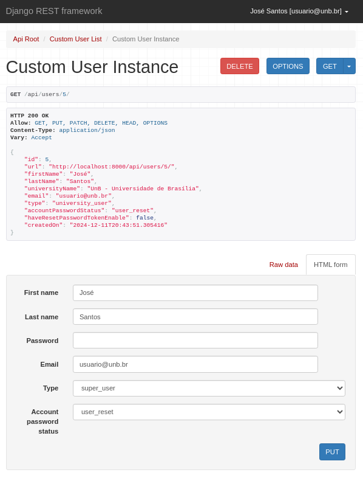
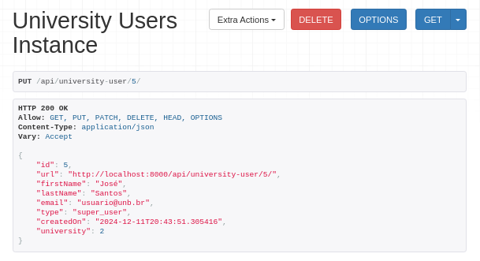
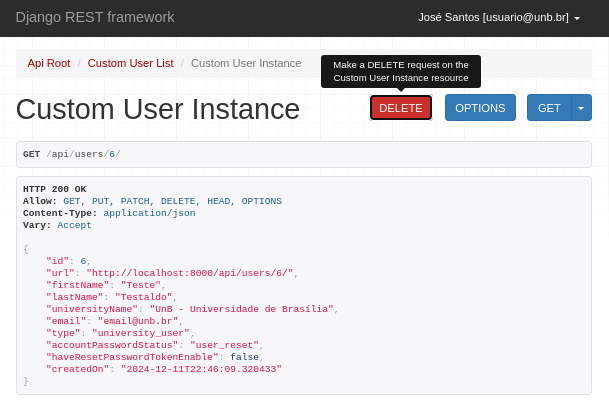
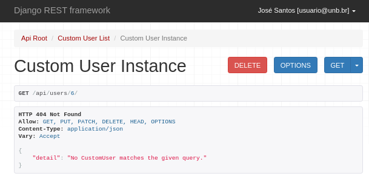
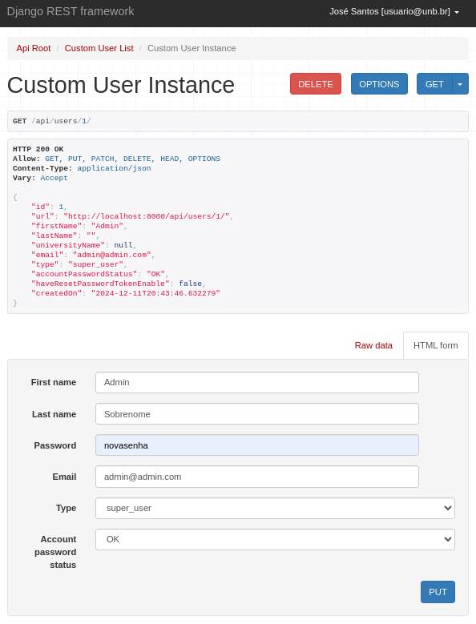
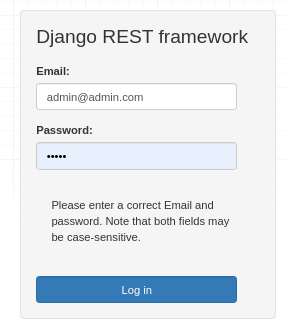

# Relatório Sprint 3

## Arthur Grandão de Mello - 211039250

## IDOR (Insecure Direct Object References)

As vulnerabilidades IDOR ocorrem quando uma aplicação web expõe uma referência direta a um objeto, como um arquivo ou recurso de banco de dados, que o usuário final pode controlar diretamente para obter acesso a outros objetos semelhantes. Se um usuário puder acessar um recurso devido à falta de um sistema sólido de controle de acesso, o sistema será considerado vulnerável.

# Vulnerabilidades

## `/api/university-users/<pk>/`  &  `/api/users/<pk>/`

Nestas rotas, mesmo logado com um usuário padrão (university-user), é possível alterar as informações de qualquer outro usuário do sistema, incluindo você mesmo, ou até mesmo deletá-los.

**Exemplos:**

* **Escalar permissão do usuário**

Podemos alterar nosso tipo de permissão no sistema, o que nos dá acesso irrestrito ao mesmo.

* **Deletar outro usuário**

Podemos deletar outro usuário.

* **Alterar senha de outros usuários**

Podemos remover o acesso de outra pessoa do sistema, ao menos temporariamente.

# Outras rotas testadas

`/api/university-user/<pk>/favorite-consumer-units\.<format>/`  
`/api/university-user/change-university-user-type/`  
`/api/university-user/change-university-user-type\.<format>/`  
`/api/users/change-user-password/`  
`/api/users/change-user-password\.<format>/`  

As rotas acima não apresentaram nenhuma vulnerabilidade IDOR.

Também não observei nenhuma chamada AJAX ao utilizar o front-end da aplicação.
