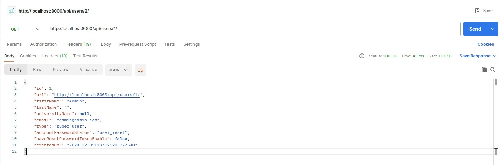
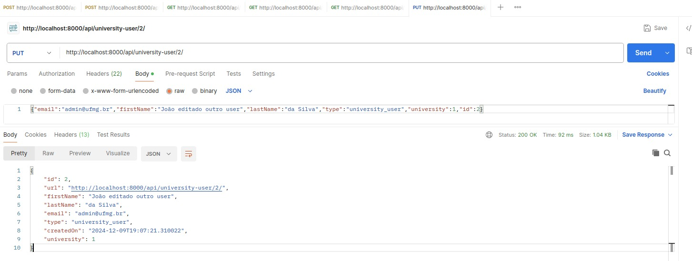
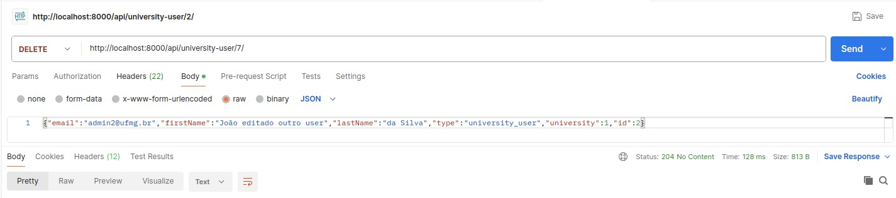
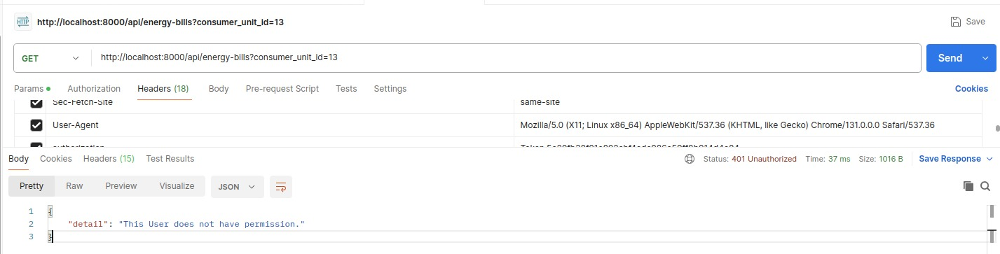
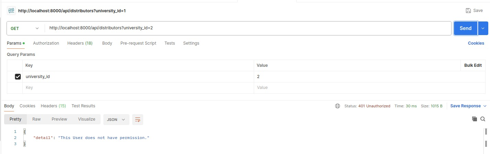

# Relatório de teste sprint 3

| Nome | Matrícula |
|-------|----------|
| Alex Gabriel Alves Faustino | 200056603 |
| Taynara Cristina Ribeiro Marcellos | 211031833 |

# Insecure Direct Object References - IDOR

## Introdução à Manipulação de Verbos HTTP

Uma vulnerabilidade combinada de IDOR (Insecure Direct Object References) e manipulação inadequada de verbos HTTP ocorre quando um aplicativo web expõe referências diretas a objetos sensíveis (como arquivos ou recursos de banco de dados) sem um controle de acesso adequado e permite o uso de métodos HTTP não restritos. Nesse cenário, um atacante pode manipular requisições com métodos inesperados (como PUT ou HEAD) para acessar objetos não autorizados ou contornar controles de segurança, expondo informações confidenciais ou realizando ações indevidas. A falta de uma verificação rigorosa de permissões, combinada com uma configuração insegura do servidor que aceita verbos HTTP desnecessários, cria uma brecha significativa. A solução envolve implementar controles de acesso robustos para referências de objetos e restringir os métodos HTTP aceitos pelo s

### Manipulação de Verbos HTTP

A manipulação de verbos HTTP explora métodos menos usados no protocolo HTTP (como PUT, DELETE, PATCH) que permitem ações sensíveis, como gravar ou excluir dados no servidor. Se o servidor ou a aplicação web não estiverem configurados para gerenciar esses métodos com segurança, atacantes podem usá-los para comprometer o sistema. Esse ataque ocorre devido a falhas de configuração, tanto no servidor quanto na aplicação. A solução é restringir os métodos aceitos e tratar adequadamente os que forem permitidos.

### Configurações Inseguras

Configurações inseguras em servidores web podem permitir que métodos HTTP não configurados para autenticação (como HEAD) sejam usados para acessar recursos restritos. Mesmo que a autenticação seja exigida para métodos como GET e POST, métodos alternativos podem ignorar essa proteção e permitir acesso não autorizado. Isso ocorre por falhas na configuração e pode levar a um bypass de autenticação.

### Codificação Insegura

A codificação insegura ocorre quando um desenvolvedor aplica filtros de segurança (como sanitização de entrada) apenas em alguns métodos HTTP, como o GET, mas não cobre todos os métodos (como POST). Isso cria uma vulnerabilidade, pois um atacante pode usar um método não filtrado (por exemplo, POST) para contornar os filtros e explorar falhas como injeção SQL. Esse tipo de erro é mais comum e ocorre devido a práticas inadequadas de codificação, ao contrário de falhas de configuração do servidor, que geralmente podem ser evitadas com boas práticas.

## Bypassando a Autenticação Básica

Explorar vulnerabilidades de Manipulação de Verbos HTTP é simples, pois envolve testar métodos HTTP alternativos para ver como o servidor e a aplicação os tratam. Vulnerabilidades causadas por configurações inseguras de servidores são fáceis de identificar e podem permitir contornar a autenticação básica. Já vulnerabilidades causadas por codificação insegura requerem testes mais detalhados. O primeiro tipo de vulnerabilidade é relacionado a configurações inseguras do servidor, o que pode permitir burlar o sistema de autenticação em algumas páginas.

### Causas Comuns
- Falta de controle de acesso robusto no back-end.
- Implementações inadequadas de controle de acesso (exemplo: falta de verificação de permissões para recursos internos).
- Acesso irrestrito a recursos protegidos apenas pelo front-end da aplicação, sem validação no servidor.

### Impacto das Vulnerabilidades IDOR
As vulnearabilidades IDOR podem causar impactos severos, como:

1. Divulgação de informações: Acesso a arquivos privados de outros usuários, como documentos pessoais e dados financeiros.
2. Modificação ou exclusão de dados: A possibilidade de modificar ou apagar dados de outros usuários.
3. Elevação de privilégios: Se um usuário comum obtiver acesso a funções administrativas, pode realizar ações como alterar senhas ou conceder permissões de administrador, levando à tomada de controle total da aplicação.

# Aplicação de testes no MEPA

## Teste 1
**Objetivo**: acessar dados de outros usuários alterando o numero na url http://localhost:8000/api/users/X/  
**Esperado**: O usuário ter permissão negada caso não seja seu ID  
**Executando teste**: Ao fazer login na aplicação e obter um token valido, podemos usar o postman e alterar o id da url, a partir disso é possivel obter informações de qualquer outro usuario desde acerte o ID e como o id é sequencial é bem simples.   
**Conclusão**: o endpoint de user está vulneravel IDOR

execução no postman:  

## Aproveitando da vulnerabilidade encontrada no endpoint de user
## Teste 1.1
**Objetivo**:Alterar informações de outros usuários  
**Esperando**: O usuário ter permissão negada  
**Executando teste**: Ao encontrar o id de outro usuário além de obter informações é possivel alterar os dados   
**conclusão**: o endpoint de user está vulneravel IDOR http PUT

Execução no postman: 

## Teste 1.2
**Objetivo**:Excluir outros usuários  
**Esperando**: O usuário ter permissão negada  
**Executando teste**: Ao encontrar o id de outro usuário, além de obter informações é possivel excluir o usuário
conclusão: o endpoint de user está vulneravel IDOR http PUT

Execução no postman: 

# Teste 2
**Objetivo**: Acessar informação de conta de unidades consumidoras de outros usuarios, por meio da url: http://localhost:8000/api/energy-bills?consumer_unit_id=X  
**Esperado**: Acesso ser negado e não receber informações  
**Executando teste**: Pegando token valido em uma sessão do sistema e tentando acessar um id valido, mas de outro usuário o recurso é negado com "this user does not have permission"  
**Conclusão**: Não está vulneravel a IDOR

execução no postman: 

# Teste 3

**Objetivo**: Acessar informação de conta de distribuidoras de outras universidades, por meio da url: http://localhost:8000/api/distributors?university_id=X  
**Esperado**: Acesso ser negado e não receber informações  
**Executando teste**: Pegando token valido em uma sessão do sistema e tentando acessar um id valido, mas de outra universidade o recurso é negado com "this user does not have permission"  
**Conclusão**: Não está vulneravel a IDOR

Execução no postman: 

# Conclusão

O endpoint de usuários está vulnerável a IDOR, permitindo que qualquer usuário com um token válido acesse, altere ou exclua dados de outros usuários. Por outro lado, os endpoints de unidades consumidoras, distribuidoras e contas estão adequadamente protegidos contra vulnerabilidades IDOR, negando o acesso a dados de outros usuários.