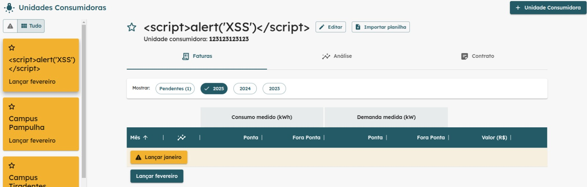

# Relatório da Sprint 4 - Avaliação de Vulnerabilidade Cross-Site Scripting (XSS)
O Cross-Site Scripting (XSS) é uma vulnerabilidade de segurança em aplicações web que permite a injeção de scripts maliciosos nas páginas acessadas por outros usuários. Tal falha pode ser explorada para roubo de cookies, manipulação de sessões, redirecionamento de usuários para sites maliciosos ou até mesmo a modificação não autorizada do conteúdo da página.

## Tipos de XSS:
 - Stored XSS (Persistente): O script malicioso é armazenado no servidor e é entregue a qualquer usuário que acesse a página vulnerável.
 - Reflected XSS: O ataque ocorre quando a entrada do usuário é refletida na resposta da aplicação sem o devido processo de sanitização.
 - DOM-Based XSS: O script malicioso é executado diretamente no navegador, manipulando o DOM da página sem interação com o servidor.
Após a realização do curso na plataforma HTB (recomendado pelo monitor), executei uma série de testes na aplicação para avaliar sua vulnerabilidade a ataques de XSS.

# Testes Realizados
## Teste 1 - Inserção de Script nos Campos de Input
Realizei a inserção do seguinte script malicioso nos campos de entrada da aplicação web:

html

### Teste 1.1 - Campo de Alteração de Senha do Usuário
A inserção do script no campo destinado à alteração da senha do usuário não gerou qualquer resposta ou vulnerabilidade à execução de XSS.
  
**Resultado**: A aplicação não está vulnerável a XSS neste ponto.

### Teste 1.2 - Campo de Busca de Instituição
Realizei o mesmo teste no campo de busca de instituição, mas também não obtive resultados de execução de XSS.
  
**Resultado**: A aplicação não está vulnerável a XSS neste ponto.

Além desses testes, também realizei inserções de script nos seguintes campos: cadastro de instituições, cadastro de pessoas, cadastro de unidades consumidoras, entre outros. Em todos os casos, não obtive resultados que indicassem a presença de vulnerabilidades XSS.

## Teste 2 - Testes nas URLs da Aplicação
Além dos campos de entrada, também realizei tentativas de injeção de script diretamente nas URLs da aplicação. Contudo, não obtive sucesso na execução de XSS, uma vez que a query não é diretamente refletida no código da página. A ausência de reflexão direta das entradas nas respostas da aplicação impede a execução de scripts maliciosos.

## Teste 3 - Armazenamento de Script e Renderização da Página
Por fim, realizei o teste de armazenar o script malicioso e observar o comportamento da aplicação ao renderizar a página web. O Stored XSS não foi executado, e não obtive resultados que indicassem a presença de vulnerabilidades.
  

# Conclusão
Após a execução dos testes realizados, concluo que a aplicação não apresenta vulnerabilidades a ataques de XSS, o que é uma excelente notícia para a segurança da aplicação e seus usuários.
