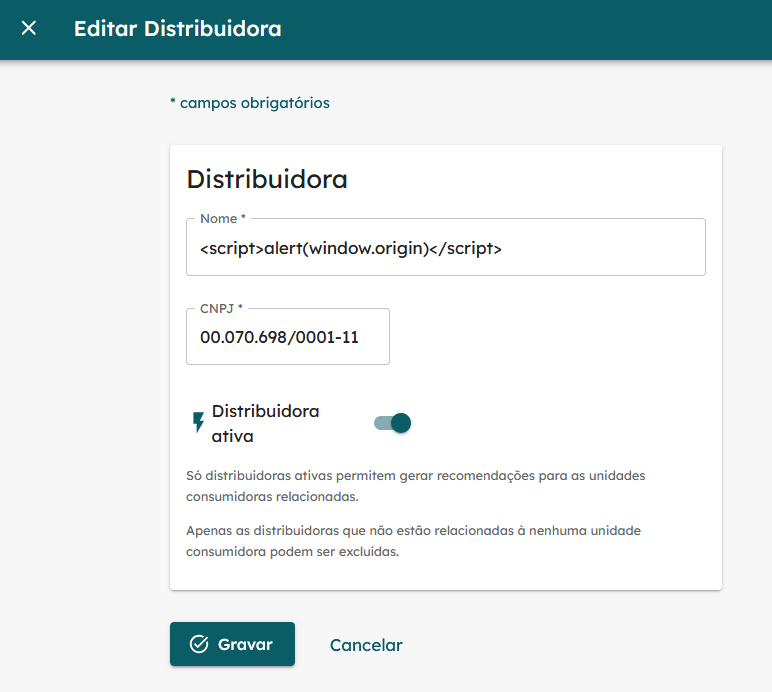
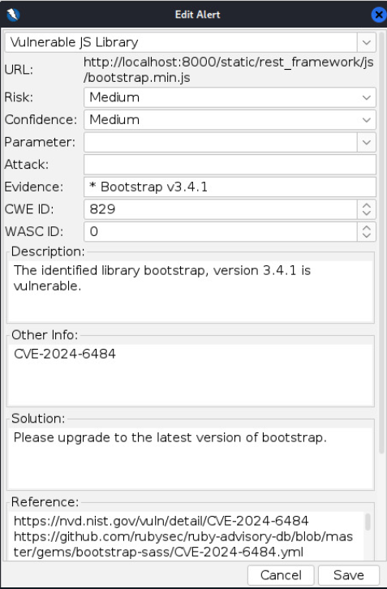

# Relatório da Sprint 4 - Cross-Site Scripting (XSS)

## Arthur Viana e Arthur Grandão

A fim de identificar vulnerabilidades de XSS, realizou-se o estudo do módulo correspondente do HTB. Por fim, na prática, os conceitos utilizados para aplicar na prática foram: Stored XSS, Reflected XSS e DOM Discovery.

### Stored XSS

Vulnerabilidade na qual scripts maliciosos são injetados e armazenados no servidor, afetando todos os usuários que acessam essas páginas. O ataque pode roubar dados ou
executar ações prejudiciais no navegador da vítima. A mitigação envolve validação, sanitização de entradas e codificação de saídas.

Como alguns inputs do usuário aparecem na tela, testou-se os seguintes inputs e outros parecidos:

- `<script>alert(window.origin)</script>`
- `<script>print('test')</script>`
- `<script>document.body.style.background = "#141d2b"</script>`

Por exemplo, foi realizado como nessa imagem:



Não foi possível encontrar vulnerabilidades nas seguintes funções:

- `editar distribuidora`
- `adicionar distribuidora`
- `editar unidade consumidora`
- `adicionar unidade consumidora`

Além disso, testou-se algumas requests que poderiam ser compatíveis com XSS:

- `https://energia.lappis.rocks/api/distributors/2/get-tariffs/?subgroup=<script>alert(window.origin)</script>`
- `https://energia.lappis.rocks/api/distributors/2/get-tariffs/?subgroup=%3Cimg%20src%3D%22x%22%20onerror%3D%22alert%28%27XSS%27%29%22%3E`

### DOM Discovery

Realizei novamente scans em modo de ataque pela ferramenta OWASP ZAP na `api` e encontrou uma versão do bootstrap que está vulnerável a ataques de Cross-Site Scripting (XSS), a correção sugerida está na imagem a seguir:



Por já ter sido realizada esta verificação antes, optei pelo uso da ferramenta open source XSStrike, sendo o comando mais básico:
`python3 xsstrike.py -u "https://energia.lappis.rocks"`. Contudo, mesmo utilizando de sessões autenticadas por meio do header, todos os testes retornaram:

```
[~] Checking for DOM vulnerabilities
[-] No parameters to test.
```

Por conta da ausência de links e de requests onde seja possível da ferramenta inserir os inputs para teste.

