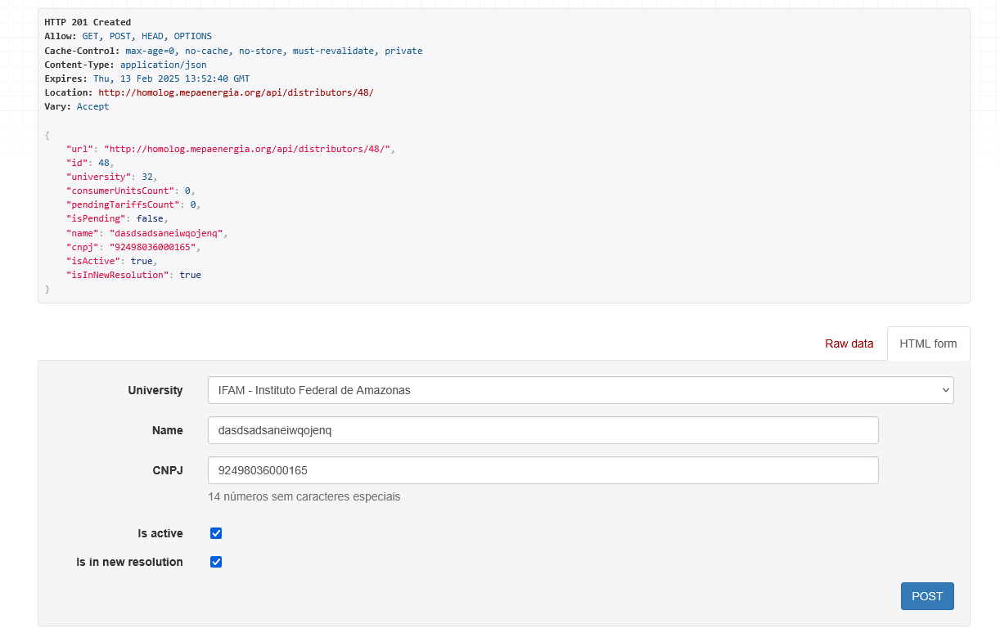
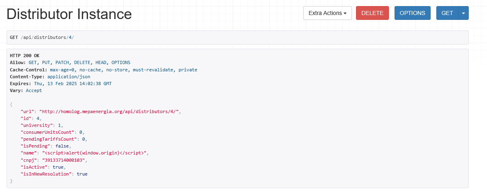
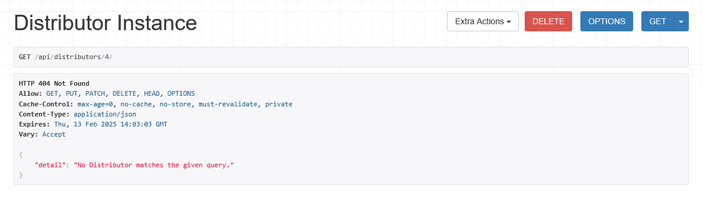
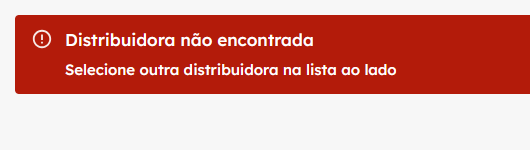

# Relatório da Sprint 5

## Arthur Viana e Arthur Grandão

## O que foi feito

Realizamos testes no controle de acesso na rota `https://homolog.mepaenergia.org/api/distributors/<pk>` da API, identificando vulnerabilidades que permitem a usuários operacionais cadastrar e excluir distribuidoras sem permissão adequada.

## Relatório

Durante a interceptação da requisição `https://homolog.mepaenergia.org/api/distributors/?university_id=1` como usuário operacional, foi possível cadastrar uma nova universidade nas distribuidoras.

Além disso, testamos o cadastro manual das distribuidoras. A única diferença observada foi a possibilidade de cadastrar novas distribuidoras em outras universidades, às quais o usuário não deveria pussuir acesso.

Ao prosseguir com os testes, verificamos que, ao cadastrar distribuidoras de ambas as formas, era possível interceptar a requisição `https://homolog.mepaenergia.org/api/distributors/3/`, e, a partir dela, mesmo sem permissão para visualizar os dados de cada distribuidora, o usuário operacional poderia excluir todas as distribuidoras apenas alterando o ID na URL da requisição para a opção DELETE.

### Antes da deleção:

### Após a deleção:

É possível notar também que essas alterações refletem diretamente no site. Por exemplo, ao acessar a distribuidora 4 em `https://homolog.mepaenergia.org/distribuidoras/4`, que o usuário possuía acesso previamente, a seguinte mensagem foi exibida após a deleção:

## Conclusão

Através dos testes realizados, identificamos vulnerabilidades no sistema de cadastro e gerenciamento de distribuidoras. Essas falhas permitem que usuários operacionais, sem as devidas permissões, realizem ações não autorizadas, como cadastrar e excluir distribuidoras. Recomendamos a revisão e correção dos controles de acesso para garantir a integridade e segurança do sistema.
