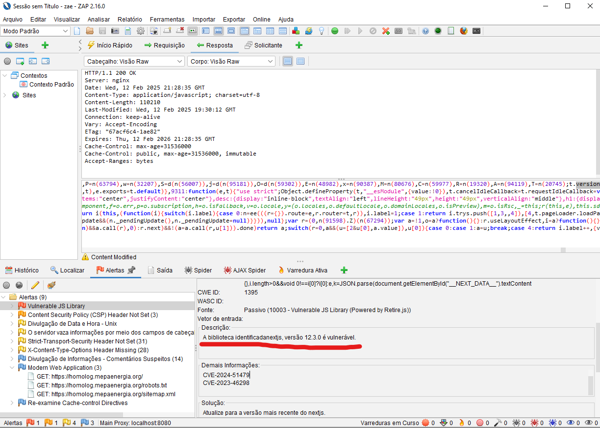

# Relatório da Sprint 5 - Avaliação de Vulnerabilidade de Configuração de Segurança (Security Misconfiguration)

A vulnerabilidade de Security Misconfiguration ocorre quando uma aplicação ou sistema possui configurações inadequadas, que podem ser exploradas por atacantes para comprometer a segurança da aplicação. Isso pode envolver a exposição indevida de informações sensíveis, falhas na configuração do servidor, permissões inadequadas ou a utilização de padrões inseguros de segurança. A configuração incorreta pode ser um ponto de entrada para diversas outras vulnerabilidades, afetando a integridade e a confidencialidade dos dados.


## Testes Realizados
### Teste 1 - Verificação de Mensagens de Erro Detalhadas
Uma das práticas recomendadas é garantir que a aplicação não exiba mensagens de erro detalhadas, pois elas podem fornecer informações sensíveis que podem ser usadas para exploração. Para testar isso:

### Teste 1.1 - Tentativa de Login com Dados Inválidos
Realizei uma tentativa de login com um nome de usuário e senha inválidos para observar o comportamento da aplicação. A aplicação deve exibir uma mensagem genérica e não detalhes sobre o motivo do erro.

**Resultado:** A aplicação exibe uma mensagem genérica "**E-mail não cadastrado e/ou senha inválida**", sem informações técnicas ou detalhes de falhas internas.

### Teste 1.2 - Envio de Dados Inválidos em Formulário de Cadastro
Enviei dados inválidos no formulário de cadastro para verificar se a aplicação exibe algum erro detalhado, no frontend é validado as entradas do usuário, como cnpj, nome e etc.

**Resultado:** Não houve exibição de mensagens técnicas ou informações detalhadas sobre a falha. A aplicação respondeu com uma mensagem de erro genérica, o que é esperado.


### Teste 2 - Exposição de Versões de Software e Tecnologias
As versões de servidores web e frameworks devem ser ocultadas para evitar que um atacante saiba exatamente quais tecnologias estão sendo utilizadas, facilitando a exploração de vulnerabilidades conhecidas.

### Teste 2.1 - Verificação de Cabeçalhos HTTP
Utilizando a ferramenta cURL, realizei uma requisição para a aplicação para verificar a presença do cabeçalho Server, que pode expor a versão do servidor.
bash
curl -I http://localhost:3000

a resposta do frontend em modo dev foi

```bash

Cache-Control: no-store, must-revalidate
X-Powered-By: Next.js
Content-Type: text/html; charset=utf-8
Vary: Accept-Encoding
Date: Mon, 10 Feb 2025 14:17:43 GMT
Connection: keep-alive
Keep-Alive: timeout=5
```


A presença do cabeçalho **X-Powered-By** indicando que a aplicação está usando Next.js pode revelar informações sobre a tecnologia usada. Essa informação pode ajudar atacantes a identificar possíveis vulnerabilidades específicas da versão do Next.js ou da configuração dessa plataforma.

no ambiente de homologação antigo obteve o seguinte resultado

```bash

HTTP/1.1 301 Moved Permanently
Server: nginx
Date: Mon, 10 Feb 2025 14:27:39 GMT
Content-Type: text/html
Content-Length: 162
Connection: keep-alive
Location: https://energia.lappis.rocks/
```

o novo ambiente de homologação teve o seguinte resultado

 https://homolog.mepaenergia.org/
```bash
HTTP/1.1 200 OK
Server: nginx
Date: Wed, 12 Feb 2025 21:14:37 GMT
Content-Type: text/html; charset=utf-8
Content-Length: 37596
Connection: keep-alive
Vary: Accept-Encoding
X-Powered-By: Next.js
ETag: "mvz808uaf2t0c"
Vary: Accept-Encoding
X-Frame-Options: SAMEORIGIN
X-Content-Type-Options: nosniff
X-XSS-Protection: 1; mode=block
Strict-Transport-Security: max-age=31536000; includeSubDomains

```
O cabeçalho Server revela que o servidor está utilizando Nginx. Isso também pode ser uma informação útil para atacantes, pois eles podem procurar por vulnerabilidades específicas da versão do Nginx em uso.

## teste 2.2

A análise realizada pelo OWASP ZAP identificou a versão da biblioteca Next.js utilizada no projeto.



A biblioteca identificada, Next.js versão 12.3.0, apresenta vulnerabilidades conhecidas.

# Conclusão

Após a execução dos testes, conclui-se que a aplicação segue boas práticas de segurança em relação a Security Misconfiguration, com exceção da exposição do servidor e da versão do Next.js. Para melhorar a segurança, recomenda-se ocultar essas informações.

## Principais Observações:

**Mensagens de Erro:** 
A aplicação não exibe mensagens detalhadas de erro, o que é uma boa prática de segurança para evitar a exposição de dados sensíveis ou informações técnicas que poderiam ser usadas por atacantes.  

**Exposição de Versões de Software:**  
A aplicação ainda revela informações sobre o uso de tecnologias específicas, como Next.js e Nginx, através dos cabeçalhos HTTP. Essas informações podem ajudar atacantes a identificar vulnerabilidades em versões específicas de tecnologias. Recomendamos a remoção ou modificação desses cabeçalhos para reduzir o risco de exploração.

**Recomendações:**  
**Desabilitar a Exposição do Cabeçalho X-Powered-By:**   
Para evitar a exposição do framework em uso, a configuração do Next.js pode ser ajustada para não exibir o cabeçalho.  
**Desabilitar a Exposição do Cabeçalho Server:**  
A configuração do Nginx pode ser ajustada para desativar o cabeçalho Server, ocultando a tecnologia do servidor.

Com base nos testes realizados, a aplicação está, em geral, bem configurada do ponto de vista de segurança, com apenas pequenas melhorias a serem feitas para garantir um nível de proteção ainda mais robusto contra possíveis explorações de vulnerabilidades associadas à configuração do servidor e aplicação.
