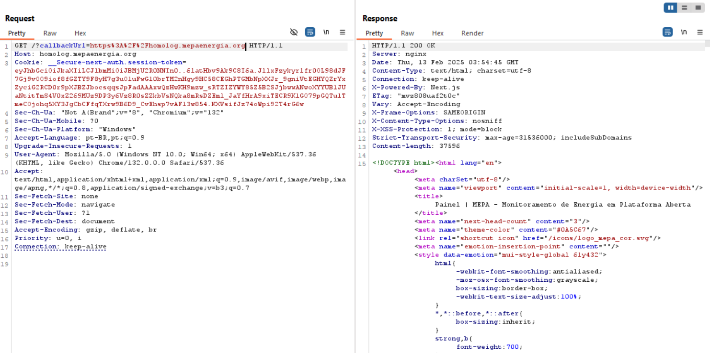
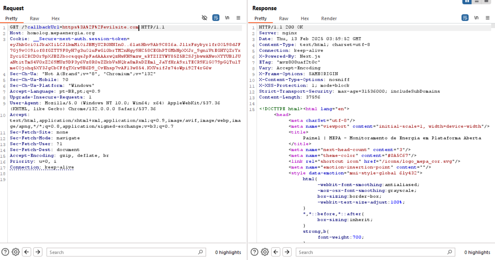

# Relatório Sprint 5 - Information Gathering

## Membros

|                        Nome                        | Matrícula |
| :------------------------------------------------: | :-------: |
| [Felipe Direito](https://github.com/felipedireito) | 190086971 |
|    [Gabriel Campello](https://github.com/G16C)     | 211039439 |
|    [Gustavo Melo](https://github.com/gusrberto)    | 211039457 |
|  [Matheus Henrique](https://github.com/mathonaut)  | 211029666 |

---

# Web Crawling com Burp Suite Spider

## Sobre

Este relatório documenta o uso do Burp Suite Spider para realizar web crawling no site da aplicação testada (homolog.mepaenergia.org). O objetivo é mapear a estrutura do site, identificar conteúdo oculto e reunir informações relevantes para uma futura análise de segurança.

## O que é Web Crawling?

Web crawling é o processo automatizado de navegação por páginas da web para coleta de informações. Ele é amplamente utilizado para indexação de sites por motores de busca, análise de vulnerabilidades e coleta de dados estruturados. No contexto de segurança, web crawlers ajudam a identificar possíveis superfícies de ataque, endpoints ocultos e conteúdo sensível exposto.

## Exemplo de uso Web Crawling 

### Configuração

1. Abrir o Burp Suite e configurar o navegador para utilizar o Burp Proxy.

2. Acessar o site da aplicação testada homolog.mepaenergia.org para capturar as primeiras requisições HTTP.

3. Navegar até a aba Target > Site Map e adicionar o site ao escopo de análise.

4. Iniciar o Burp Suite Spider para explorar as URLs e coletar informações.

### Resultado 
A seguir na Imagem 1 podemos ver o uso da ferramenta burp para realizar o Web Crawling no site de homologação do MEPA.

###### Imagem 1

A partir das informações obtidas com o processo de web Crawling é possível realizar ataques mais precisos em cima de possíveis fragilidades do site como mostro a seguir na Imagem 2 e 3.

###### Imagem 2 

 
Imagem com requisição padrão para o site: GET /?callbackUrl=https%3A%2F%2Fhomolog.mepaenergia.org 
Resposta dentro do esperado OK.

###### Imagem 3

Imagem com requisição para site falso do tipo: GET /?callbackUrl=https%3A%2F%2Fevilsite.com
Resposta obtida: OK.

O que indica que a depender da requisição feita para autenticação de login podemos acabar entrando em uma url falsa sem notar. 

### Conclusão
Com o Web Crawling fui capaz de identificar um erro que anteriormente não tinha sido capaz de confirmar, e usando as ferramentas adequadas consegui, isso indica que algém com mior treinamento na parte de invasões poderia acabar toamndo controle de uma requisição feita por um usuário sem que api notasse. 

## Histórico de Versões

| Versão | Data       | Descrição                               | Autor(es)                                        |
| ------ | ---------- | --------------------------------------- | ------------------------------------------------ |
| `1.0`  | 10/02/2025 | Criação do documento.  | [Gabriel Campello](https://github.com/G16C)      |