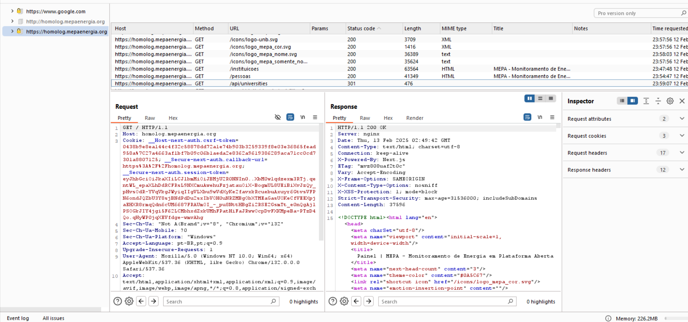

# Relatório Sprint 5 - Information Gathering

## Membros

|                        Nome                        | Matrícula |
| :------------------------------------------------: | :-------: |
| [Felipe Direito](https://github.com/felipedireito) | 190086971 |
|    [Gabriel Campello](https://github.com/G16C)     | 211039439 |
|    [Gustavo Melo](https://github.com/gusrberto)    | 211039457 |
|  [Matheus Henrique](https://github.com/mathonaut)  | 211029666 |

---

# Web Crawling com Burp Suite Spider

## Sobre

Este relatório documenta o uso do Burp Suite Spider para realizar web crawling no site da aplicação testada (homolog.mepaenergia.org). O objetivo é mapear a estrutura do site, identificar conteúdo oculto e reunir informações relevantes para uma futura análise de segurança.

## O que é Web Crawling?

Web crawling é o processo automatizado de navegação por páginas da web para coleta de informações. Ele é amplamente utilizado para indexação de sites por motores de busca, análise de vulnerabilidades e coleta de dados estruturados. No contexto de segurança, web crawlers ajudam a identificar possíveis superfícies de ataque, endpoints ocultos e conteúdo sensível exposto.

## Exemplo de uso Web Crawling

### Configuração

1. Abrir o Burp Suite e configurar o navegador para utilizar o Burp Proxy.

2. Acessar o site da aplicação testada homolog.mepaenergia.org para capturar as primeiras requisições HTTP.

3. Navegar até a aba Target > Site Map e adicionar o site ao escopo de análise.

4. Iniciar o Burp Suite Spider para explorar as URLs e coletar informações.

### Resultado

A seguir na Imagem 1 podemos ver o uso da ferramenta burp para realizar o Web Crawling no site de homologação do MEPA.

###### Imagem 1



A partir das informações obtidas com o processo de web Crawling é possível realizar ataques mais precisos em cima de possíveis fragilidades do site como mostro a seguir na Imagem 2 e 3.

###### Imagem 2


Imagem com requisição padrão para o site: GET /?callbackUrl=https%3A%2F%2Fhomolog.mepaenergia.org
Resposta dentro do esperado OK.

###### Imagem 3


Imagem com requisição para site falso do tipo: GET /?callbackUrl=https%3A%2F%2Fevilsite.com
Resposta obtida: OK.

O que indica que a depender da requisição feita para autenticação de login podemos acabar entrando em uma url falsa sem notar.

### Conclusão

Com o Web Crawling fui capaz de identificar um erro que anteriormente não tinha sido capaz de confirmar, e usando as ferramentas adequadas consegui, isso indica que algém com mior treinamento na parte de invasões poderia acabar toamndo controle de uma requisição feita por um usuário sem que api notasse.

# Fingerprinting

É uma técnica utilizada na identificação de sistemas, aplicações ou dispositivos, buscando características únicas do sistema que podem ser exploradas. Como cabeçalhos HTTP, respostas a tipos específicos de pacotes e até assinatura digitais. É usado principalmente para **auditoria de segurança**, realizando um mapeamento do sistema, identificando potenciais vulnerabilidades.

## Banner Grabbing

```c
$ curl -I https://homolog.mepaenergia.org/

HTTP/1.1 200 OK
Server: nginx
Date: Wed, 12 Feb 2025 23:49:37 GMT
Content-Type: text/html; charset=utf-8
Content-Length: 37596
Connection: keep-alive
Vary: Accept-Encoding
X-Powered-By: Next.js
ETag: "mvz808uaf2t0c"
Vary: Accept-Encoding
X-Frame-Options: SAMEORIGIN
X-Content-Type-Options: nosniff
X-XSS-Protection: 1; mode=block
Strict-Transport-Security: max-age=31536000; includeSubDomains
```

A requisição acima mostrou a pilha tecnológica da aplicação (Nginx e Next.js) o que poderia auxiliar a ataques direcionados por parte de usuários maliciosos, mas que no caso do MEPA não é uma grande problema já que o projeto é Open-Source.
Quanto aos cabeçalhos de segurança é possível ver que a aplicação já protege contra diversos tipos de ataques, como possível melhoria só daria a sugestão de mais dois cabeçalhos:

- `Content-Security-Police (CSP)`: Auxilia mais ainda na proteção contra XSS e outros ataques colocando restrições no carregamento de scripts.
- `Referrer-Policy: no-referrer` ou `strict-origin-when-cross-origin`: Controlam o envio de informações de referenciador para evitar o vazamento de dados sensíveis.

## Wafw00f (Identificação de WAF)


O teste mostrou nenhum Web Application Firewall (WAF) foi detectado, o que pode deixar a aplicação vulnerável a alguns tipos de ataques entre eles:

- Cross-Site Scripting (XSS)
- Remote Code Execution (RCE)
- Directory Traversal
- Ataques de Força Bruta

Um WAF adiciona uma camada extra de defesa que pode detectar e bloquear automaticamente várias dessas ameaças antes delas sequer chegarem ao sistema.

### Conclusão

A análise realizada mostrou que a aplicação já conta com boas práticas de segurança, mas pode ser fortalecida com a adição de cabeçalhos como CSP e Referrer-Policy. Além disso, a ausência de um Web Application Firewall (WAF) pode expor o sistema a ataques como XSS e RCE. Implementar um WAF ajudaria a mitigar essas ameaças, adicionando uma camada extra de proteção.

# Obtenção de Informações com WHOIS, WhatWeb, DIG e Enumeração de DNS

Este estudo tem como objetivo principal analisar a segurança e o nível de exposição de informações dos domínios `_mepaenergia.org_` e `_homolog.mepaenergia_.org`. Para isso, serão empregadas ferramentas como WHOIS e WhatWeb, juntamente com técnicas de enumeração de DNS, incluindo o uso de Dig, DNSenum e Gobuster.

As ferramentas WHOIS, WhatWeb, e as técnicas de enumeração de DNS (Dig, DNSenum e Gobuster), serão utilizadas para coletar informações sobre domínios e tecnologias web. O WHOIS fornece dados de registro de domínios e IPs, o WhatWeb identifica tecnologias utilizadas em sites, e a enumeração de DNS busca subdomínios e informações adicionais. Dig realiza consultas DNS, Gobuster realiza força bruta para descobrir subdomínios e arquivos, e DNSenum enumera subdomínios e coleta informações de DNS para auditorias de segurança.

## Metologia

Os testes foram realizados utilizando as configurações padrões do WHOIS e o endereço principal da aplicação mepaenergia.org. No caso do WhatWeb, foi utilizado o comando padrão, juntamente com a flag `-v`, para tornar o resultado mais detalhado. Para os testes com Dig, não foram utilizadas flags adicionais, sendo os endereços homolog.mepaenergia.org e mepaenergia.org os alvos da análise. No teste com DNSenum, foram utilizadas as flags `--enum`, `-f` e `-r`, enquanto no Gobuster, foram utilizados os comandos vhost e as flags `-u`, `-w` e `--append-domain`. Em ambos os testes, foi utilizada uma lista contendo um milhão de nomes para as buscas.

## Resultados

### Teste com WHOIS

Os testes realizados com o WHOIS demonstraram que não foi possível detectar informações relevantes, pois a maioria dos dados estava restrita. Os resultados indicam um bom nível de privacidade nas informações do domínio. A figura 4 mostra os resultados.

<center>

Figura 4 - Resultado do teste com whois.


</center>

### Teste com WhatWeb

No teste com WhatWeb, foi identificado que a aplicação utiliza `Next.js` e que está configurada de maneira adequada, utilizando Nginx e cabeçalhos de segurança como `X-XSS-Protection` e `X-Frame-Options`. Com a flag `-v`, foram obtidos mais detalhes das informações já identificadas anteriormente, mas nenhuma nova informação relevante foi encontrada. As figuras 5 e 6 mostram os resultados obtidos.

<center>

Figura 5 - Resultado do teste com whatweb no domínio de homologação.


</center>

<center>

Figura 6 - Resultado do teste com whatweb.


</center>

### Teste com Dig

A execução do Dig permitiu capturar os endereços IP relacionados aos domínios homolog.mepaenergia.org e mepaenergia.org, confirmando a existência de registros DNS válidos e configurados corretamente. As figuras 7 e 8 mostram os resultados.

<center>

Figura 7 - Resultado do teste com dig no domínio de homologação.


</center>

<center>

Figura 8 - Resultado do teste com dig no domínio `mepaenergia.org`.


</center>

### Teste com DNSenum

No teste realizado com DNSenum, foram identificados dois pontos de risco. O primeiro é a ativação do Wildcard, que pode possibilitar ataques de phishing. O segundo ponto de risco identificado é a exposição do servidor de e-mail, o que pode representar uma vulnerabilidade para ataques direcionados. As figuras 9 e 10 mostram os resultados.

<center>

Figura 9 - Resultado do teste com dnsenum no domínio `mepaenergia.org`.


</center>

<center>

Figura 10 - Resultado do teste com dnsenum mostrando o wildcard ativado.


</center>

### Teste com Gobuster

Os testes com Gobuster não resultaram na identificação de hosts virtuais com a lista de 1 milhão de nomes, indicando que a estrutura do servidor não expõe subdomínios adicionais de maneira evidente. A figura 11 mostra o resultado.

<center>

Figura 11 - Resultado do teste com gobuster.


</center>

## Conclusão

A análise realizada demonstrou que o domínio mepaenergia.org está razoavelmente protegido, com restrição de informações sensíveis no WHOIS e configuração adequada do servidor. No entanto, a ativação do Wildcard e a exposição do servidor de e-mail representam riscos potenciais, exigindo medidas de mitigação.

## Histórico de Versões

| Versão | Data       | Descrição                                      | Autor(es)                                        |
| ------ | ---------- | ---------------------------------------------- | ------------------------------------------------ |
| `1.0`  | 10/02/2025 | Criação do documento.                          | [Gabriel Campello](https://github.com/G16C)      |
| `1.1`  | 13/02/2025 | Adição de testes de Fingerpriting.             | [Gustavo Melo](https://github.com/gusrberto)     |
| `1.2`  | 13/02/2025 | Adiciona relatório de obtenção de informações. | [Matheus Henrique](https://github.com/mathonaut) |
