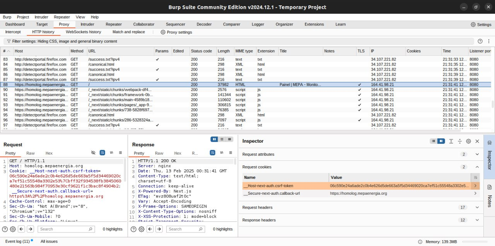

# Relatório Sprint 5 - Teste de Sessão e Estresse

## Membros

| Nome | Matrícula |
| :--: | :-------: |
| [Mateus Fidelis](https://github.com/MatsFidelis) | 200073184 |
| [Pablo Guilherme](https://github.com/PabloGJBS) | 200025791 |
| [Pedro Lucas](https://github.com/AlefMemTav)     | 190115548 |
| [Rafael Bosi](https://github.com/strangeunit28) | 211029559 |

---

## Sobre 

Este relatório apresenta uma análise da segurança de sessão do site, com foco em práticas de segurança relacionadas à regeneração de sessão, configuração de cookies e proteção contra ataques CSRF (Cross-Site Request Forgery).

---

## Testes de sessão no MEC Energia

### Regeneração de Sessão

A regeneração de sessão é uma prática de segurança importante para prevenir ataques de fixação de sessão. Durante os testes, foi observado que o cookie de sessão (__Secure-next-auth.session-token) é regenerado corretamente após o login e logout. Isso indica que a aplicação está implementando boas práticas de segurança, garantindo que a sessão do usuário seja renovada e protegida contra possíveis ataques.

### Configurações de Segurança dos Cookies

Os cookies de sessão e CSRF foram analisados para verificar se possuem as configurações de segurança adequadas. As seguintes observações foram feitas:

Cookie de Sessão (__Secure-next-auth.session-token):



HttpOnly: O cookie é marcado como HttpOnly, o que impede que ele seja acessível via JavaScript, protegendo contra ataques de Cross-Site Scripting (XSS).
Secure: O cookie é marcado como Secure, garantindo que ele só seja enviado em conexões HTTPS, protegendo contra ataques de interceptação de cookies em conexões não seguras.

SameSite=Lax: O cookie é marcado como SameSite=Lax, ajudando a proteger contra ataques de Cross-Site Request Forgery (CSRF) ao permitir que o cookie seja enviado apenas em requisições de navegação de primeiro nível.
Cookie CSRF (__Host-next-auth.csrf-token):


O cookie CSRF está presente e é usado para proteger contra ataques CSRF. O fato de ele não mudar após login/logout não é necessariamente um problema, desde que ele seja gerado de forma segura e validado corretamente em cada requisição.

Proteção CSRF


A proteção contra ataques CSRF é essencial para garantir que as requisições feitas em nome do usuário sejam legítimas. Durante os testes, foi verificado que o token CSRF (__Host-next-auth.csrf-token) está presente e é utilizado para proteger contra ataques CSRF. É importante garantir que este token seja validado corretamente em cada requisição POST para prevenir ataques.


### Verificações Adicionais

Para garantir a segurança completa da sessão, as seguintes verificações adicionais foram recomendadas:

Expiração da Sessão:

Certificar-se de que a sessão expira após um período de inatividade ou após um tempo definido. Isso pode ser configurado no NextAuth.js com a opção maxAge.
Validação do Token CSRF:

Verificar se o token CSRF é validado corretamente em cada requisição POST. Tentar fazer uma requisição POST sem o token CSRF ou com um token CSRF inválido e verificar se a requisição é rejeitada com um erro de CSRF.
Conclusão
Com base nas informações fornecidas e nas verificações realizadas, o site parece estar bem configurado em termos de segurança de sessão. A regeneração do cookie de sessão após login/logout, juntamente com as configurações de segurança dos cookies (HttpOnly, Secure e SameSite=Lax), indicam que boas práticas de segurança estão sendo seguidas. A presença e utilização do token CSRF também contribuem para a proteção contra ataques CSRF.

No entanto, é sempre recomendável realizar auditorias de segurança regulares e testes de penetração para garantir que todas as possíveis vulnerabilidades sejam identificadas e corrigidas. Seguindo as práticas recomendadas e realizando verificações adicionais conforme mencionado, o site estará em uma boa posição para garantir a segurança das sessões dos usuários.

## Teste rodando DOOM na tela de login do MEPA

Um teste realizado pela equipe foi a tentativa de rodar doom nos campos de inserir texto da aplicação mas não obtivemos sucesso porem pensamos na alternativa e se desse pra rodar doom por cima da logo do mepa e seguimos com esta ideia

Para a realização do experimento utilizamos a ferramenta do inspecionar elementos do navegador, acessamos o codiog html da aplicação na tela de login e alteramos o body do codigo para que ele tivesse um canvas que pudesse renderizar o jogo

```HTML
<body style="overflow: hidden; position: relative;">
  <div id="__next">
    <div class="MuiBox-root mui-style-1svsvwq">
      <div class="MuiBox-root mui-style-3ff7w1">
        <div class="MuiPaper-root MuiPaper-elevation MuiPaper-rounded MuiPaper-elevation1 mui-style-9mlw10">
          <form class="MuiBox-root mui-style-gsjzcg">
            <div class="MuiBox-root mui-style-84zz9f">
              <span style="box-sizing: border-box; display: inline-block; overflow: hidden; width: initial; height: initial; background: none; opacity: 1; border: 0px; margin: 0px; padding: 0px; position: relative; max-width: 100%;">
                <span style="box-sizing: border-box; display: block; width: initial; height: initial; background: none; opacity: 1; border: 0px; margin: 0px; padding: 0px; max-width: 100%;">
                  
                </span>
                
                <noscript></noscript>
              </span>
            </div>
            <!-- Resto do formulário -->
          </form>
        </div>
      </div>
    </div>
  </div>
  <!-- Canvas para o jogo DOOM (alterado para centralizar e sobrepor) -->
  <canvas id="doomCanvas" style="position: absolute; top: 50%; left: 50%; transform: translate(-50%, -50%); z-index: 9999; width: 800px; height: 600px;" width="800" height="600"></canvas>
</body>
```

Desta forma o canvas poderia sobrepor os outros elementos e o script poderia executar 

No console do inspecionar elementos utilizamos este codigo

```c
(function() {
  // 1. Configuração do canvas
  const canvas = document.getElementById('doomCanvas');
  const ctx = canvas.getContext('2d');

  // Define o tamanho do canvas
  const maxGameWidth = 800;
  const maxGameHeight = 600;
  const gameWidth = Math.min(maxGameWidth, window.innerWidth - 20);
  const gameHeight = Math.min(maxGameHeight, window.innerHeight - 20);
  canvas.width = gameWidth;
  canvas.height = gameHeight;

  // Bloqueia o scroll da página para evitar que as teclas de seta rolem o documento
  document.body.style.overflow = 'hidden';
  window.addEventListener('keydown', function(e) {
    if (["ArrowUp", "ArrowDown", "ArrowLeft", "ArrowRight"].includes(e.key)) {
      e.preventDefault();
    }
  }, { passive: false });

  // 2. Parâmetros e dados do jogo
  const wallShades = ['#000000', '#111111', '#222222', '#333333', '#444444', '#555555', '#666666', '#777777', '#888888', '#999999'];
  const floorShades = ['#AAAAAA', '#BBBBBB', '#CCCCCC', '#DDDDDD', '#EEEEEE', '#FFFFFF'];
  const ceilingShades = ['#999999', '#888888', '#777777', '#666666', '#555555', '#444444'];

  const mapWidth = 16;
  const mapHeight = 16;
  const map = [
    "################",
    "#..............#",
    "#..............#",
    "#...##...##....#",
    "#...##...##....#",
    "#..............#",
    "#..............#",
    "#..............#",
    "#..............#",
    "#..............#",
    "#...#######....#",
    "#..............#",
    "#..............#",
    "#..............#",
    "#..............#",
    "################"
  ];

  // Estado inicial do jogador
  let playerX = 8;
  let playerY = 8;
  let playerAngle = 0;         // em radianos
  const fov = Math.PI / 4;     // campo de visão de 45°
  const depth = 16;            // distância máxima de renderização

  // Variáveis para cálculo de FPS (opcional)
  let lastTime = performance.now();
  let fps = 0;

  // Objeto para controle das teclas pressionadas
  const keys = {};
  window.addEventListener('keydown', (e) => { keys[e.key] = true; });
  window.addEventListener('keyup', (e) => { keys[e.key] = false; });

  // 3. Loop principal do jogo (raycasting e renderização)
  function gameLoop() {
    const now = performance.now();
    const elapsed = now - lastTime;
    lastTime = now;
    fps = Math.round(1000 / elapsed);

    // Atualiza posição e rotação do jogador
    const moveSpeed = 0.1;
    const rotSpeed = 0.05;
    if (keys["ArrowLeft"])  playerAngle -= rotSpeed;
    if (keys["ArrowRight"]) playerAngle += rotSpeed;
    if (keys["ArrowUp"]) {
      const newX = playerX + Math.cos(playerAngle) * moveSpeed;
      const newY = playerY + Math.sin(playerAngle) * moveSpeed;
      if (map[Math.floor(newY)][Math.floor(newX)] !== '#') {
        playerX = newX;
        playerY = newY;
      }
    }
    if (keys["ArrowDown"]) {
      const newX = playerX - Math.cos(playerAngle) * moveSpeed;
      const newY = playerY - Math.sin(playerAngle) * moveSpeed;
      if (map[Math.floor(newY)][Math.floor(newX)] !== '#') {
        playerX = newX;
        playerY = newY;
      }
    }

    // Limpa o canvas
    ctx.clearRect(0, 0, canvas.width, canvas.height);

    // Renderização da cena com raycasting (para cada coluna)
    for (let x = 0; x < canvas.width; x++) {
      // Calcula o ângulo do raio para a coluna atual
      const rayAngle = (playerAngle - fov / 2) + (x / canvas.width) * fov;
      let distanceToWall = 0;
      let hitWall = false;
      let boundary = false;  // Para acentuar bordas

      const eyeX = Math.cos(rayAngle);
      const eyeY = Math.sin(rayAngle);

      // Avança o raio até bater em uma parede ou atingir a distância máxima
      while (!hitWall && distanceToWall < depth) {
        distanceToWall += 0.05;
        const testX = Math.floor(playerX + eyeX * distanceToWall);
        const testY = Math.floor(playerY + eyeY * distanceToWall);
        if (testX < 0 || testX >= mapWidth || testY < 0 || testY >= mapHeight) {
          hitWall = true;
          distanceToWall = depth;
        } else {
          if (map[testY][testX] === '#') {
            hitWall = true;
            // Verifica bordas para efeito de contorno
            let p = [];
            for (let tx = 0; tx < 2; tx++) {
              for (let ty = 0; ty < 2; ty++) {
                const vx = (testX + tx) - playerX;
                const vy = (testY + ty) - playerY;
                const d = Math.sqrt(vx * vx + vy * vy);
                const dot = (eyeX * vx / d) + (eyeY * vy / d);
                p.push([d, dot]);
              }
            }
            p.sort((a, b) => a[0] - b[0]);
            const boundAngle = 0.01;
            if (Math.acos(p[0][1]) < boundAngle) {
              boundary = true;
            }
          }
        }
      }

      // Determina onde começa o teto e o chão nesta coluna
      const ceiling = Math.floor(canvas.height / 2 - canvas.height / distanceToWall);
      const floorLine = canvas.height - ceiling;

      // Renderiza o teto
      for (let y = 0; y < ceiling; y++) {
        const t = y / ceiling;
        let shadeIndex = Math.floor(t * ceilingShades.length);
        if (shadeIndex < 0) shadeIndex = 0;
        if (shadeIndex >= ceilingShades.length) shadeIndex = ceilingShades.length - 1;
        ctx.fillStyle = ceilingShades[shadeIndex];
        ctx.fillRect(x, y, 1, 1);
      }

      // Renderiza as paredes
      for (let y = ceiling; y < floorLine; y++) {
        const ratio = distanceToWall / depth;
        let shadeIndex = Math.floor(ratio * wallShades.length);
        if (shadeIndex < 0) shadeIndex = 0;
        if (shadeIndex >= wallShades.length) shadeIndex = wallShades.length - 1;
        ctx.fillStyle = wallShades[shadeIndex];
        ctx.fillRect(x, y, 1, 1);
      }

      // Renderiza o chão
      for (let y = floorLine; y < canvas.height; y++) {
        const b = 1 - ((y - canvas.height / 2) / (canvas.height / 2));
        let floorIndex = Math.floor(b * floorShades.length);
        if (floorIndex < 0) floorIndex = 0;
        if (floorIndex >= floorShades.length) floorIndex = floorShades.length - 1;
        ctx.fillStyle = floorShades[floorIndex];
        ctx.fillRect(x, y, 1, 1);
      }
    }

    // 4. HUD e Minimapa
    ctx.fillStyle = 'white';
    ctx.font = '12px monospace';
    ctx.fillText("ASCII DOOM  |  FPS: " + fps, 10, 20);
    ctx.fillText("Posição: (" + playerX.toFixed(2) + ", " + playerY.toFixed(2) + ") | Ângulo: " + (playerAngle * (180/Math.PI)).toFixed(2) + "°", 10, 40);

    // Minimapa
    const miniMapSize = 100;
    const miniMapScale = miniMapSize / mapWidth;
    for (let my = 0; my < mapHeight; my++) {
      for (let mx = 0; mx < mapWidth; mx++) {
        if (map[my][mx] === '#') {
          ctx.fillStyle = 'white';
        } else {
          ctx.fillStyle = 'black';
        }
        ctx.fillRect(mx * miniMapScale, my * miniMapScale + canvas.height - miniMapSize, miniMapScale, miniMapScale);
      }
    }

    // Desenha o jogador no minimapa
    ctx.fillStyle = 'red';
    ctx.fillRect(playerX * miniMapScale - 2, playerY * miniMapScale + canvas.height - miniMapSize - 2, 4, 4);

    requestAnimationFrame(gameLoop);
  }

  // Inicia o loop do jogo
  gameLoop();
})();
```

E apos algumas alterações e correções nas posições obtivemos sucesso ao rodar o jogo 


## Teste de estresse no MEC Energia

### Introdução

Esta etapa documenta um teste de estresse conduzido na API de autenticação do site [homolog.mepaenergia.org](https://homolog.mepaenergia.org/api-auth/login) para avaliar sua resiliência sob alto volume de requisições. O teste foi realizado utilizando a ferramenta k6 com um script que simulava um ataque DDoS enviando múltiplas requisições de login simultâneas.

### Metodologia

O teste foi dividido em duas fases:

- Simulação inicial do ataque: Foram geradas 1000 requisições simultâneas por um período de 30 segundos.

- Aprimoramento do backend e novos testes: Implementação de medidas de mitigacão e reavaliação dos resultados.

O script utilizado no primeiro teste foi:

```javascript
import http from 'k6/http';
import { sleep } from 'k6';

export const options = {
  vus: 1000,
  duration: '30s',
};

export default function () {
  const url = 'https://homolog.mepaenergia.org/api-auth/login/';
  
  const payload = {
    csrfmiddlewaretoken: '50vdCV204LCbF6JEgF6FClLpdpbA1DF6OiQL5BSaVaomWJ9zALr2p0hY5ljLVHp4',
    next: '',
    username: 'usuario@unb.br',
    password: 'unb',
    submit: 'Log in'
  };
  
  const params = {
    headers: {
      'Content-Type': 'application/x-www-form-urlencoded',
    },
  };
  
  const response = http.post(url, payload, params);
  console.log('Response status:', response.status);
  
  sleep(1);
}
```

### Resultados

- Fase 1 - Impacto do Teste Inicial

Durante a primeira execução do teste, foi observado que o site apresentou lentidão significativa devido ao alto volume de requisições simultâneas. O servidor demorava a responder, e alguns acessos foram negados devido a timeouts.

#### Mitigação

Diante do impacto gerado pelo ataque, foram implementadas medidas para proteger a API de login e melhorar a resiliência do sistema:

1. Rate Limiting no Django

Foi introduzido um controle de taxa diretamente no backend Django, utilizando a seguinte configuração:

'DEFAULT_THROTTLE_RATES': {
    'anon': '100/hour',  # Limita usuários não autenticados a 100 requisições por hora
    'user': '1000/hour',  # Limita usuários autenticados a 1000 requisições por hora
},

No entanto, esse método não foi eficaz para mitigar um ataque massivo, sobrecarregando o servidor antes mesmo que o Django pudesse aplicar as restrições.

2. Rate Limiting no Nginx

Para um controle mais efetivo, foi implementado um rate limiting diretamente no Nginx, com a seguinte configuração:

```yml
limit_req_zone $binary_remote_addr zone=mylimit:10m rate=10r/s;
server {
  location / {
    limit_req zone=mylimit burst=20 nodelay;
    limit_req_status 427;
    proxy_pass http://127.0.0.1:3000;
  }
}
```

Essa configuração limita cada endereço IP a um máximo de 10 requisições por segundo, permitindo um burst de até 20 requisições antes de rejeitar requisições adicionais com o status 427 Too Many Requests.

3. Reteste e Análise Final

Após implementar a mitigação no Nginx, um novo teste foi conduzido, utilizando 10.000 requisições simultâneas em 60 segundos com o seguinte script:

```javascript
import http from 'k6/http';
import { sleep } from 'k6';

export const options = {
  vus: 10000,
  duration: '60s',
};

export default function () {
  const baseUrl = 'https://homolog.mepaenergia.org';
  
  const csrfResponse = http.get(`${baseUrl}/api-auth/login/`);
  const csrfToken = csrfResponse.headers['Set-Cookie']?.match(/csrftoken=([^;]+)/)?.[1] || '';
  
  if (!csrfToken) {
    console.log('CSRF Token não encontrado');
    return;
  }
  
  const url = `${baseUrl}/api-auth/login/`;
  const payload = `csrfmiddlewaretoken=${csrfToken}&next=&username=usuario@unb.br&password=unb&submit=Log+in`;
  
  const params = {
    headers: {
      'Content-Type': 'application/x-www-form-urlencoded',
      'Cookie': `csrftoken=${csrfToken}`,
      'X-CSRFToken': csrfToken,
    },
  };
  
  const response = http.post(url, payload, params);
  console.log('Response status:', response.status);
  
  sleep(1);
}
```

Com essa abordagem, o servidor não ficou completamente indisponível, porém não funciona de forma totalmente aceitável, pois:

Apesar do rate limiting no Nginx permitir uma recuperação mais rápida do sistema.

Sob ataque, a aplicação continuou a responder as requisições legítimas com degradação extrema do desempenho.

### Conclusão

O teste de estresse demonstrou que a API de login era vulnerável a ataques de alto volume, levando a atrasos no serviço. O Throttling no Django foi insuficiente para mitigar o impacto, enquanto a implementação de um rate limiting no Nginx foi uma solução que trouxe um pouco mais de resultado, melhorando a capacidade de recuperação do sistema.

## Referências

- OWASP Foundation. Session Management Cheat Sheet. Disponível em: https://cheatsheetseries.owasp.org/cheatsheets/Session_Management_Cheat_Sheet.html. Acesso em: 13 de fev de 2025.
- Mozilla Developer Network (MDN). SameSite cookies. Disponível em: https://developer.mozilla.org/en-US/docs/Web/HTTP/Headers/Set-Cookie/SameSite. Acesso em: 13 de fev de 2025.
- Mozilla Developer Network (MDN). HttpOnly and Secure flags. Disponível em: https://developer.mozilla.org/en-US/docs/Web/HTTP/Cookies#restrict_access_to_cookies. Acesso em: 13 de fev de 2025.
- OWASP Foundation. Cross-Site Request Forgery (CSRF) Prevention Cheat Sheet. Disponível em: https://cheatsheetseries.owasp.org/cheatsheets/Cross-Site_Request_Forgery_Prevention_Cheat_Sheet.html. Acesso em: 13 de fev de 2025.
- NextAuth.js. Secure Session Handling. Disponível em: https://next-auth.js.org/getting-started/introduction. Acesso em: 13 de fev de 2025.
GitHub. DOOM on Web Browsers. Disponível em: https://github.com/fcambus/jsemu. Acesso em: 13 de fev de 2025.

